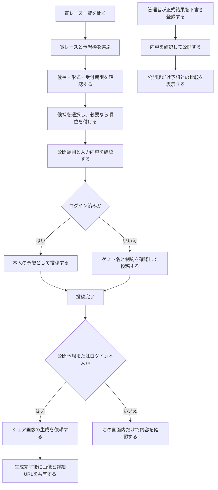
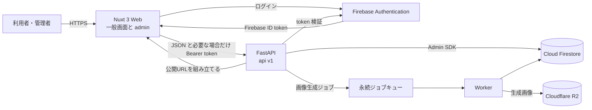
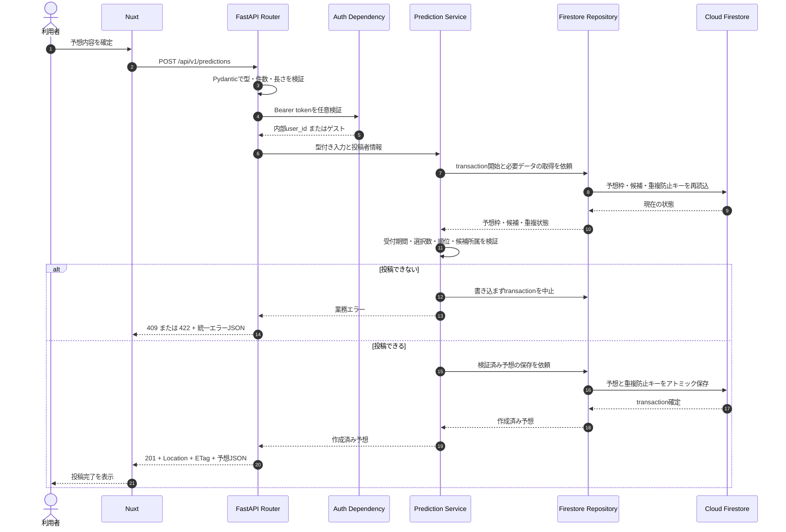

# お笑い賞レースの予想サイト

お笑い賞レースの準決勝進出者、決勝進出者、優勝者などを予想し、ファン同士で共有して楽しむための Web アプリケーションです。

予想の的中を利用者同士の競争に変えないことを重視しています。ユーザー単位の的中率、順位表、恒常的なランキング、および人気の低さを可視化する機能は提供しません。

> [!IMPORTANT]
> このリポジトリは現在、要件・設計段階です。`apps/web`、`apps/api`、依存関係の manifest、lockfile、Firebase Emulator の設定はまだありません。そのため、現時点で Web/API を起動することはできません。本 README の「アプリ実装後の標準セットアップ」は、実装時に満たすべき標準手順を示しています。

## 目次

- [このサービスでできること](#このサービスでできること)
- [利用者から見た処理の流れ](#利用者から見た処理の流れ)
- [システム構成](#システム構成)
- [リポジトリ構成](#リポジトリ構成)
- [環境構築](#環境構築)
- [使い方](#使い方)
- [API の利用例](#api-の利用例)
- [開発と品質チェック](#開発と品質チェック)
- [重要な仕様と安全上の注意](#重要な仕様と安全上の注意)
- [設計資料](#設計資料)

## このサービスでできること

| 利用者 | 主な操作 |
| --- | --- |
| ゲスト | 公開済みの賞レース・予想枠・公開予想の閲覧、予想の新規投稿 |
| ログインユーザー | ゲスト向け機能、自分の予想の閲覧・編集・削除、非公開予想、フォロー、マイページ |
| 管理者 | 賞レース、予想枠、候補、正式結果の管理、完全一致した公開予想の確認 |

予想には次の2形式があります。

- `ranking`: 候補へ1位、2位のような連続した順位を付ける形式
- `selection`: 順位を付けず、指定数の候補を選ぶ形式

投稿ごとに `public` または `private` を選べます。ゲストも非公開で投稿できますが、本人確認の手段がないため、内容を確認できるのは作成直後のレスポンスだけです。ゲスト投稿は後から編集・削除できません。

## 利用者から見た処理の流れ

次の図は、賞レースを探してから予想を投稿し、必要に応じて共有するまでの流れを示します。



正式結果の SNS 告知やメタデータには、進出者名や順位などのネタバレを含めません。閲覧者が自分の意思で詳細ページを開く導線にします。

## システム構成

### 全体構成

ブラウザは業務データを Cloud Firestore へ直接読み書きしません。すべての業務ルールと認可を FastAPI に集約します。



| 区分 | 技術 | 役割 |
| --- | --- | --- |
| Web | Nuxt 3 + TypeScript | 一般画面、`/admin` 配下の管理画面、SSR |
| API | FastAPI + Pydantic v2 | HTTP、入出力検証、認証・認可、OpenAPI |
| 認証 | Firebase Authentication | Google、メール認証、ログイン後の X 連携 |
| DB | Cloud Firestore Standard | 賞レース、予想枠、予想、正式結果などの保存 |
| 画像 | Cloudflare R2 | 許諾済み画像と生成したシェア画像の保存 |
| 非同期処理 | Cloud Tasks 等の永続キュー + Worker | シェア画像生成などの確実な実行 |
| ローカル結合テスト | Firebase Local Emulator Suite | Auth、Firestore、Security Rules の検証 |
| 本番実行基盤 | Cloudflare Pages / Cloud Run | Web / API の配信 |

### 予想作成の内部処理

`Router -> Service -> Repository -> Cloud Firestore` の順に責務を分けます。予想と選択内容、認証済みユーザー用の重複防止キーは同じ transaction で保存し、途中状態を残しません。



各層の役割は次のとおりです。

- Router: パス、HTTP メソッド、ヘッダー、Schema、レスポンスを扱う
- Schema: Pydantic で入力と出力の契約を分ける
- Service: 認可、受付期間、選択数、順位、重複などの業務ルールを扱う
- Repository: Firestore の query、mapping、transaction / batch を隠蔽する
- Exception handler: 例外を全 API 共通のエラー JSON に変換する

## リポジトリ構成

現在存在するのは設計資料と品質チェック用スクリプトです。

```text
award_race_app/
├── AGENTS.md
├── README.md
├── doc/
│   ├── FastAPI_API設計ベストプラクティス.md
│   ├── お笑い賞レースの予想サイト.md
│   └── 機能.csv
└── scripts/
    └── check.ps1
```

実装時の標準配置は次のとおりです。

```text
award_race_app/
├── apps/
│   ├── web/                         # Nuxt。一般画面と /admin
│   └── api/
│       ├── app/
│       │   ├── api/v1/endpoints/    # HTTP の解釈
│       │   ├── schemas/             # Pydantic 入出力契約
│       │   ├── services/            # 業務ルールと transaction 境界
│       │   ├── repositories/        # 保存先の抽象
│       │   ├── repositories/firestore/
│       │   ├── domain/
│       │   ├── core/
│       │   └── workers/
│       ├── firebase/                # rules と indexes
│       └── tests/
│           ├── unit/
│           ├── integration/
│           └── contract/
├── packages/api-client/             # OpenAPI から生成する TypeScript client
├── infra/
├── doc/
└── scripts/
```

## 環境構築

### 1. 現在のリポジトリを確認する

必要なものは Git と Windows PowerShell 5.1 以降、または PowerShell 7 です。

```powershell
git clone <repository-url>
Set-Location award_race_app
powershell -NoProfile -ExecutionPolicy Bypass -File ./scripts/check.ps1
```

現在は `apps/web` と `apps/api` がないため、チェック結果には両方が未構築でスキップされたことが表示されます。これはアプリのテストが成功したという意味ではありません。

### 2. アプリ実装後の前提ツール

アプリがスキャフォールドされた後は、次のツールを使用します。バージョンは将来追加される runtime 設定や manifest を正とし、README に固定値を重複して持たせません。

| ツール | 用途 |
| --- | --- |
| Node.js / pnpm | Nuxt の依存導入・起動・検証 |
| Python / uv | FastAPI の依存導入・起動・検証 |
| Java と Firebase CLI | Firebase Local Emulator Suite |
| Git | ソース管理 |

依存関係のインストールには、commit 済みの lockfile を使用します。

```powershell
Set-Location apps/web
pnpm install --frozen-lockfile

Set-Location ../api
uv sync --frozen
```

`pnpm-lock.yaml` または `uv.lock` が存在しない現在の状態では、これらのコマンドは実行できません。依存を意図的に追加・更新するときだけ通常の package manager コマンドで lockfile を生成し、manifest と一緒に変更します。

### 3. ローカル設定を用意する

実装時に追加される `.env.example` をコピーし、安全なローカル用ダミー値または Emulator の設定を記入します。必要な変数名は `.env.example` と型付き設定コードを正とします。

- `.env`、`.env.local`、サービスアカウント JSON、token、秘密鍵を commit しない
- ローカル結合テストは Firebase Emulator だけに接続する
- 本番・共有 Firebase プロジェクトをテスト先にしない
- 本番の秘密情報は Secret Manager で管理する

現時点では `.env.example` と Emulator 設定が未作成なので、設定項目はまだ確定していません。

### 4. ローカルサービスを起動する

実装後は次の順序で起動します。Emulator の具体的な起動 script と port は、今後追加される `firebase.json` と package scripts に従ってください。

1. Firebase Authentication / Firestore Emulator を起動する。
2. API を起動する。
3. Web を起動する。

API:

```powershell
Set-Location apps/api
uv run uvicorn app.main:app --reload
```

Web:

```powershell
Set-Location apps/web
pnpm dev
```

起動後の URL は各プロセスの表示を確認してください。Uvicorn の既定設定を変更していなければ API は `http://127.0.0.1:8000`、OpenAPI UI は `http://127.0.0.1:8000/docs` です。

## 使い方

### 一般利用者

1. `/award-races` で公開済みの賞レースを探します。
2. `/award-races/[awardRaceId]` で賞レースの説明と予想枠を確認します。
3. `/prediction-slots/[slotId]` で候補、予想形式、受付期限、公開予想を確認します。
4. `/prediction-slots/[slotId]/predict` で予想を入力します。
5. `public` または `private` を選択し、内容を確認して投稿します。
6. 公開予想、またはログイン本人の予想であれば、投稿完了後にシェア画像を生成できます。

`ranking` 形式では、1から始まる欠番・重複のない順位が必要です。`selection` 形式では順位を入力しません。いずれも、候補の重複、別の予想枠の候補、予想枠の最小・最大選択数に反する入力は受け付けません。

### ゲスト利用時の注意

- 投稿時に `guest_display_name` が必要です。
- 投稿後の編集、削除、マイページからの再取得はできません。
- 非公開予想は作成直後の画面を離れると再取得できません。
- ゲストの非公開予想からはシェア画像を生成できません。

後から編集したい場合や、非公開予想をマイページで確認したい場合は、投稿前に Google またはメールアドレスでログインします。

### ログインユーザー

- `/me/predictions` で自分の公開・非公開予想を確認できます。
- 自分の予想は受付期間中だけ編集・削除できます。
- 同じ予想枠へ有効な予想を2件投稿することはできません。
- 削除後は、別の `Idempotency-Key` を使って受付期間中に再投稿できます。
- `/me/followed-award-races` でフォロー中の賞レースを確認できます。

### 管理者

管理画面は同じ Nuxt アプリの `/admin` 配下にあります。画面側のルート制御に加え、FastAPI が管理 API の呼び出しごとに管理者権限を検証します。

1. 賞レースを下書き作成し、予想枠、候補、受付期間を設定します。
2. 内容を確認して賞レースと予想枠を公開します。
3. 締切後、公式発表を基に正式結果を `draft` で登録します。
4. 内容を再確認し、正式結果を `published` にします。
5. 結果公開後に限り、完全一致した公開予想を紹介候補として確認できます。

正式結果は `draft` の間は公開 API に出ません。完全一致候補を確認しても、通算的中率や利用者ランキングは計算・公開しません。

主な画面ルート:

| URL | 用途 | 認証 |
| --- | --- | --- |
| `/` | 開催中・近日開催の賞レース | 不要 |
| `/award-races` | 賞レース一覧 | 不要 |
| `/prediction-slots/[slotId]` | 予想枠詳細・公開予想一覧 | 不要 |
| `/prediction-slots/[slotId]/predict` | 予想入力・確認・完了 | 任意 |
| `/predictions/[predictionId]` | 公開予想または本人の予想詳細 | 条件付き |
| `/me` | マイページ | 必須 |
| `/admin` | 管理ダッシュボード | admin 必須 |

## API の利用例

Base URL は `/api/v1`、JSON フィールドは snake_case、公開 ID は UUID、日時は UTC の ISO 8601 形式です。以下の ID と token は説明用の値であり、実在する認証情報ではありません。

### 1. 公開済み賞レースを取得する

入力:

```http
GET /api/v1/award-races?year=2026&status=published&sort=-year&limit=20
Accept: application/json
```

出力例:

```json
{
  "items": [
    {
      "id": "018f47b2-9347-738b-99c6-3c95f6999a82",
      "name": "サンプルお笑いグランプリ",
      "year": 2026,
      "description": "今年一番おもしろい漫才師を決める大会です。",
      "status": "published",
      "thumbnail_url": "https://assets.example.com/award-races/sample.webp"
    }
  ],
  "page": {
    "limit": 20,
    "next_cursor": null,
    "has_next": false
  }
}
```

一覧の `limit` は既定20、最大100です。0件でも `200 OK` と `items: []` を返します。次ページがある場合は `next_cursor` を次のリクエストの `cursor` にそのまま渡します。`offset` は使用しません。

### 2. ログインユーザーが順位付き予想を投稿する

入力:

```http
POST /api/v1/predictions HTTP/1.1
Authorization: Bearer <firebase-id-token>
Content-Type: application/json
Idempotency-Key: 3b1d4f65-22e4-4e11-9284-690e8cc37d32
X-Request-ID: 018f47b2-9b0d-7c2f-9038-3db6889e0871
```

```json
{
  "prediction_slot_id": "018f47b2-14bb-7a62-a9c9-2f23d25ab421",
  "visibility": "public",
  "reason": "今年のネタの安定感を重視しました。",
  "selections": [
    {
      "question_option_id": "018f47b2-5f3f-71de-bf54-b24345e18402",
      "rank": 1
    },
    {
      "question_option_id": "018f47b2-6b6b-773f-a51b-72ed4d658f92",
      "rank": 2
    }
  ]
}
```

成功時のヘッダー:

```http
HTTP/1.1 201 Created
Location: /api/v1/predictions/018f47b2-f23d-7bc1-a231-90fca62d7e65
ETag: "prediction-018f47b2-f23d-7bc1-a231-90fca62d7e65-v1"
X-Request-ID: 018f47b2-9b0d-7c2f-9038-3db6889e0871
```

出力例:

```json
{
  "id": "018f47b2-f23d-7bc1-a231-90fca62d7e65",
  "prediction_slot_id": "018f47b2-14bb-7a62-a9c9-2f23d25ab421",
  "author": {
    "type": "user",
    "display_name": "予想好き"
  },
  "visibility": "public",
  "reason": "今年のネタの安定感を重視しました。",
  "selections": [
    {
      "question_option_id": "018f47b2-5f3f-71de-bf54-b24345e18402",
      "talent_name": "サンプルコンビA",
      "rank": 1
    },
    {
      "question_option_id": "018f47b2-6b6b-773f-a51b-72ed4d658f92",
      "talent_name": "サンプルコンビB",
      "rank": 2
    }
  ],
  "result_comparison": null,
  "version": 1,
  "created_at": "2026-09-28T10:30:00Z",
  "updated_at": "2026-09-28T10:30:00Z",
  "links": {
    "self": "/api/v1/predictions/018f47b2-f23d-7bc1-a231-90fca62d7e65",
    "share_assets": "/api/v1/predictions/018f47b2-f23d-7bc1-a231-90fca62d7e65/share-assets"
  }
}
```

`Idempotency-Key` は認証済み POST で24時間再利用されます。同じキーと同じ本文の再送には最初の結果を返し、本文だけが異なる場合は `409 IDEMPOTENCY_KEY_REUSED` を返します。

### 3. ゲストが順位なし予想を投稿する

ゲストは `Authorization` と `Idempotency-Key` を送らず、本文に `guest_display_name` を含めます。

```json
{
  "prediction_slot_id": "018f47b2-27ac-75fc-8653-2aac046518b2",
  "guest_display_name": "お笑い好きゲスト",
  "visibility": "public",
  "reason": null,
  "selections": [
    {
      "question_option_id": "018f47b2-5f3f-71de-bf54-b24345e18402"
    },
    {
      "question_option_id": "018f47b2-6b6b-773f-a51b-72ed4d658f92"
    }
  ]
}
```

ログイン済みリクエストで `guest_display_name` を送った場合や、`selection` 形式で `rank` を送った場合は `422 Unprocessable Entity` です。`user_id`、`role`、`created_at`、的中情報はクライアントから受け付けません。

### 4. 予想を競合なく更新する

取得時に受け取った ETag を `If-Match` に指定し、予想全体を `PUT` で置き換えます。`prediction_slot_id` と投稿者は変更できません。

```http
PUT /api/v1/predictions/018f47b2-f23d-7bc1-a231-90fca62d7e65
Authorization: Bearer <firebase-id-token>
If-Match: "prediction-018f47b2-f23d-7bc1-a231-90fca62d7e65-v1"
Content-Type: application/json
```

```json
{
  "visibility": "private",
  "reason": "直近の敗者復活戦を見て変更しました。",
  "selections": [
    {
      "question_option_id": "018f47b2-6b6b-773f-a51b-72ed4d658f92",
      "rank": 1
    },
    {
      "question_option_id": "018f47b2-5f3f-71de-bf54-b24345e18402",
      "rank": 2
    }
  ]
}
```

ETag が古い場合は `412 Precondition Failed`、受付終了後は `409 PREDICTION_CLOSED`、他人の予想や存在を秘匿すべき非公開予想は `404 RESOURCE_NOT_FOUND` を返します。

### 5. シェア画像を非同期生成する

入力:

```http
POST /api/v1/predictions/018f47b2-f23d-7bc1-a231-90fca62d7e65/share-assets
Authorization: Bearer <firebase-id-token>
Content-Type: application/json
```

```json
{
  "template": "square",
  "hide_result": true
}
```

受付時の出力:

```http
HTTP/1.1 202 Accepted
Location: /api/v1/share-assets/018f47b2-d1ee-7676-a145-33600d0f7881
Retry-After: 3
```

```json
{
  "id": "018f47b2-d1ee-7676-a145-33600d0f7881",
  "status": "queued",
  "image_url": null,
  "status_url": "/api/v1/share-assets/018f47b2-d1ee-7676-a145-33600d0f7881"
}
```

完了後の状態取得:

```json
{
  "id": "018f47b2-d1ee-7676-a145-33600d0f7881",
  "status": "completed",
  "image_url": "https://assets.example.com/share/018f47b2-d1ee-7676-a145-33600d0f7881.webp",
  "expires_at": "2026-10-05T10:30:00Z"
}
```

クライアントは `Retry-After` を尊重して指数バックオフで状態を確認し、`completed` または `failed` になったらポーリングを停止します。

### 6. エラーを処理する

すべての API エラーは同じ構造です。クライアントは表示用の `message` ではなく、安定した `error.code` で分岐します。

```http
HTTP/1.1 422 Unprocessable Entity
Content-Type: application/json
X-Request-ID: 018f47b2-9b0d-7c2f-9038-3db6889e0871
```

```json
{
  "error": {
    "code": "DUPLICATE_RANK",
    "message": "同じ順位を複数の候補に設定できません。",
    "details": [
      {
        "field": "selections.1.rank",
        "reason": "rank 1 が重複しています"
      }
    ],
    "trace_id": "018f47b2-9b0d-7c2f-9038-3db6889e0871"
  }
}
```

主なステータスコード:

| HTTP | 意味 |
| ---: | --- |
| `401` | token がない、無効、または期限切れ |
| `403` | 認証済みだが操作権限がない |
| `404` | 対象がない、または存在を秘匿する |
| `409` | 受付終了、二重投稿など現在状態との競合 |
| `412` | ETag が一致せず更新が競合した |
| `422` | 型、件数、候補、順位などの検証違反 |
| `429` | 用途別のレート制限を超えた |

## 開発と品質チェック

リポジトリルートから、存在する対象の品質ゲートをまとめて実行します。

```powershell
powershell -NoProfile -ExecutionPolicy Bypass -File ./scripts/check.ps1
```

対象を限定する場合:

```powershell
powershell -NoProfile -ExecutionPolicy Bypass -File ./scripts/check.ps1 -Target frontend
powershell -NoProfile -ExecutionPolicy Bypass -File ./scripts/check.ps1 -Target backend
```

PowerShell 7 では次の形式も利用できます。

```powershell
pwsh -NoProfile -File ./scripts/check.ps1
```

実装後に実行される品質ゲート:

```text
Frontend: pnpm lint -> pnpm typecheck
Backend : ruff check -> ruff format --check -> mypy -> pytest
```

バックエンドを個別に確認する場合:

```powershell
Set-Location apps/api
uv run ruff check .
uv run ruff format --check .
uv run mypy app tests
uv run pytest
```

フロントエンドを個別に確認する場合:

```powershell
Set-Location apps/web
pnpm lint
pnpm typecheck
pnpm build
```

結合テストでは Firebase Local Emulator Suite を使用します。本番または共有クラウドへ接続した状態でテストを実行してはいけません。

## 重要な仕様と安全上の注意

- 非公開予想を本人以外の一覧・詳細・シェア画像 API へ出さない
- ゲスト投稿は作成だけを許可し、後からの編集・削除・マイページ取得を許可しない
- 正式結果は `published` 後だけ公開する
- Firebase UID、メールアドレス、token、内部コレクション名、スタックトレースを API 応答やログへ出さない
- 画像は利用根拠・出典・権利条件を記録できるものだけを扱い、許諾確認前は表示しない
- ユーザー単位の的中率、ランキング、人気の低さを示す集計を実装しない
- Nuxt から Firestore へ直接アクセスせず、FastAPI を唯一の業務データ経路にする
- transaction 内で外部 API、メール、キュー投入などの副作用を実行しない
- API の JSON 全体や `Authorization` ヘッダーをログへ記録しない

## 設計資料

詳細仕様は次の文書を参照してください。内容が食い違う場合は、プロジェクト固有の仕様書を優先します。

- [お笑い賞レースの予想サイト](./doc/お笑い賞レースの予想サイト.md): プロダクト要件、MVP、Firestore、画面、API、セキュリティ、受け入れ基準
- [FastAPI API 設計ベストプラクティス](./doc/FastAPI_API設計ベストプラクティス.md): HTTP/API 契約、責務分離、検証、エラー設計
- [AGENTS.md](./AGENTS.md): このリポジトリで実装・テスト・レビューを行う際の共通ルール

未決事項は、宣材写真と過去結果の利用条件、芸人ごとの人気集計を提供するか、ゲスト投稿を将来アカウントへ引き継ぐか、の3点です。いずれも要件を確定するまで実装しません。
