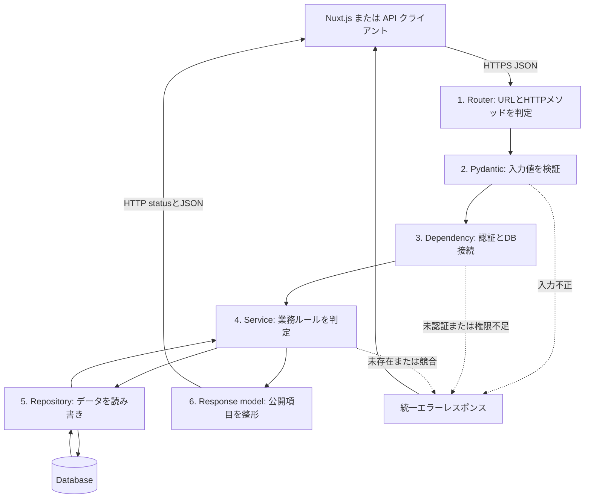
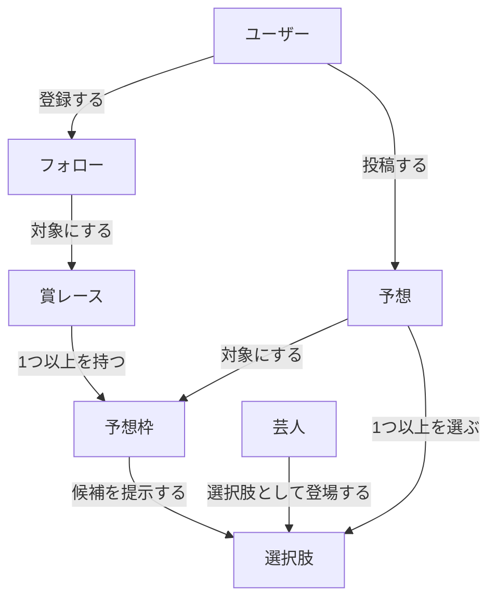
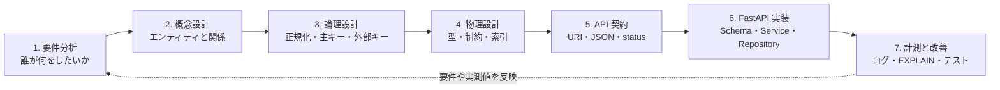
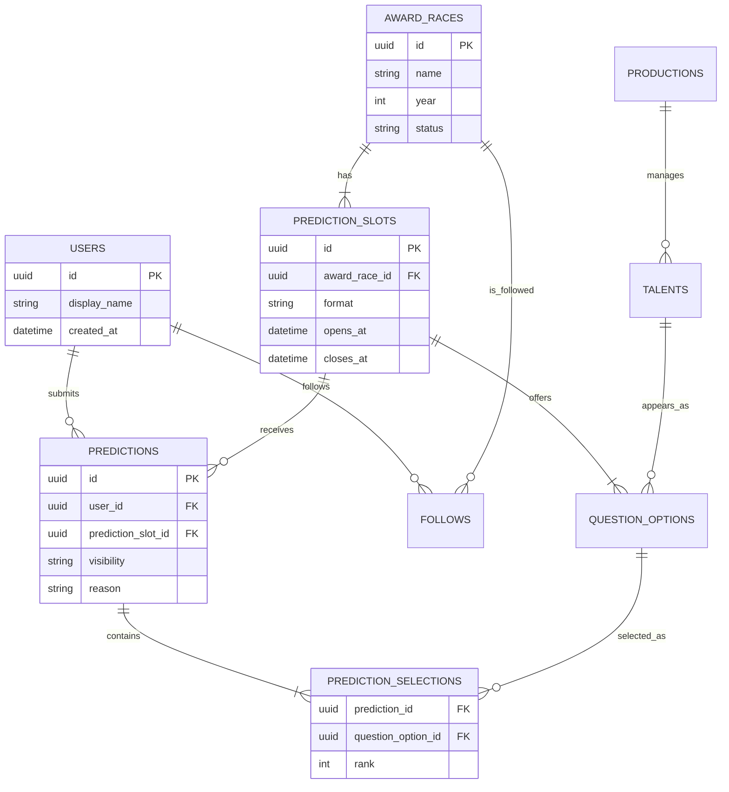
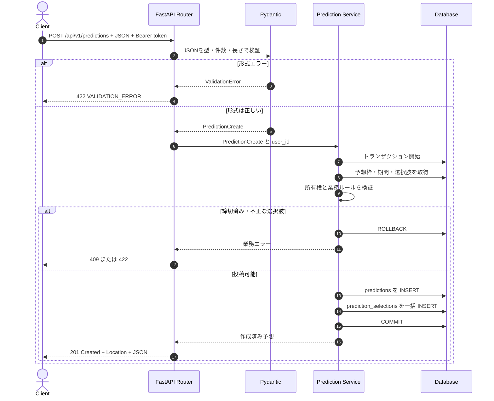
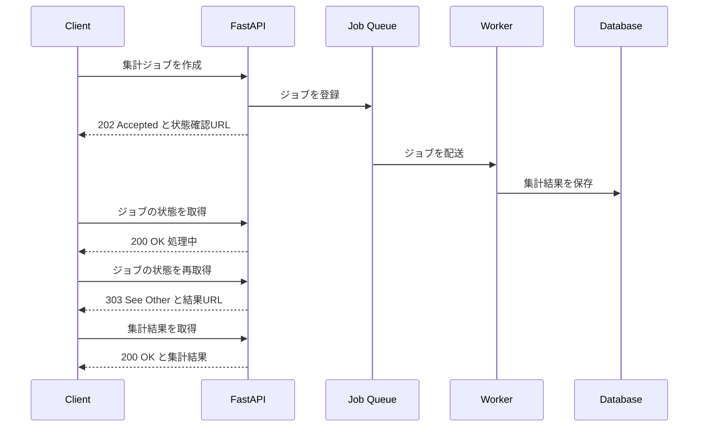

# データベース設計から考える FastAPI REST API 設計ベストプラクティス

> 対象: お笑い賞レース予想サイトのバックエンド API  
> 主な設計基準: [Qiita「リレーショナルデータベース設計の完全ガイド」](https://qiita.com/K3n_to_n17/items/02d8c63a820d50a71842)  
> API 設計の補助資料: [Microsoft Learn「RESTful Web API 設計のベスト プラクティス」](https://learn.microsoft.com/ja-jp/azure/architecture/best-practices/api-design)  
> 想定: FastAPI + Pydantic v2 + SQLAlchemy 2.x + PostgreSQL、JSON API、URI バージョニング

## 1. この文書の目的

この文書は、参照記事の「要件分析 → 概念設計 → 論理設計 → 物理設計」というデータベース設計プロセスを、REST API と FastAPI の実装へ落とし込むための設計指針である。初めて API を読む人が、次の順序で処理を追えることを目標とする。

1. クライアントが HTTP リクエストを送る。
2. FastAPI が URL、入力値、認証情報を検証する。
3. ユースケース層が業務ルールを判断する。
4. リポジトリ層がデータを読み書きする。
5. FastAPI が決められた JSON と HTTP ステータスで応答する。

大切なのは、Pydantic だけ、または DB 制約だけに整合性を任せないことである。API は分かりやすいエラーを早く返し、Service は業務ルールを守り、DB は同時実行時にも壊れない最後の砦となる。

この文書の JSON とコードは説明用だが、命名とレスポンス形式は実装時の標準として利用できる。プロジェクト概要にはデータベースとして Firebase が記載されているが、本書は参照記事に合わせて RDB（PostgreSQL）を前提にする。Firestore を採用する場合も API 契約は流用できる一方、外部キー・一意制約・JOIN・トランザクション・索引の実現方法は別途設計する必要がある。

## 2. 先に覚える設計原則

| 原則 | 推奨 | 避ける例 |
| --- | --- | --- |
| URI は操作ではなくリソースを表す | `POST /api/v1/predictions` | `POST /api/v1/create-prediction` |
| コレクションは複数形にする | `/award-races`, `/predictions` | `/award-race`, `/prediction-list` |
| 操作は HTTP メソッドで表す | `DELETE /predictions/{id}` | `POST /predictions/{id}/delete` |
| URI のネストは浅くする | `/award-races/{id}/prediction-slots` | `/users/{id}/award-races/{id}/slots/{id}/predictions` |
| 入力用と出力用のモデルを分ける | `PredictionCreate` / `PredictionRead` | DB モデルをそのまま返す |
| 状態コードを意味どおりに使う | 作成は `201`、削除成功は `204` | すべて `200` |
| API はステートレスにする | 各リクエストに認証情報を含める | サーバーのメモリ上の会話状態に依存する |
| 一覧には上限を設ける | `limit=20`、最大 `100` | 全件を無制限に返す |
| エラー形式を統一する | `code`, `message`, `details`, `trace_id` | エンドポイントごとに異なる形式 |
| 破壊的変更は新バージョンにする | `/api/v2/...` | v1 のフィールドを突然削除する |
| 整合性を複数層で守る | Pydantic + Service + DB 制約 | Router の `if` だけに依存する |
| 複数テーブル更新を原子的に行う | 1ユースケースを1トランザクションにする | 親だけ保存されて子が失敗する |
| クエリから索引を設計する | 絞り込みと並び順に合う複合索引 | 全カラムへ無条件に索引を張る |

## 3. リクエストからレスポンスまでの流れ



責務を分ける理由は、HTTP の都合、業務ルール、DB の都合を混在させないためである。

- Router: HTTP を解釈し、Service を呼ぶ。複雑な業務ロジックを書かない。
- Schema: 入出力の契約を Pydantic で表す。
- Service: 「締切後は予想を変更できない」などの業務ルールを扱う。
- Repository: SQL や Firestore など、保存先固有の処理を隠す。
- Exception handler: どの機能でも同じ形式のエラーを返す。

## 4. リソースを決める

API は DB テーブルの公開窓口ではない。利用者が扱うビジネス上の対象をリソースとして設計する。このサイトの主なリソースは次のとおり。



### 4.1 URI の命名

基本形は `/api/{version}/{複数形のリソース名}` とする。パスは小文字の kebab-case、JSON フィールドは snake_case に統一する。

| 用途 | URI | 説明 |
| --- | --- | --- |
| 賞レース一覧 | `/api/v1/award-races` | コレクション |
| 賞レース詳細 | `/api/v1/award-races/{award_race_id}` | 単一リソース |
| 賞レースに属する予想枠 | `/api/v1/award-races/{award_race_id}/prediction-slots` | 親子関係が明確な浅いネスト |
| 予想枠詳細 | `/api/v1/prediction-slots/{slot_id}` | ID が分かれば直接取得できる |
| 自分の予想一覧 | `/api/v1/me/predictions` | 認証ユーザーを表す疑似リソース |
| 予想詳細 | `/api/v1/predictions/{prediction_id}` | 単一リソース |

次のような深い URI は避ける。

```text
/api/v1/users/{user_id}/award-races/{race_id}/prediction-slots/{slot_id}/predictions/{prediction_id}
```

クライアントがすべての親 ID を知る必要があり、リソース関係の変更にも弱いためである。

### 4.2 DB テーブルと API リソースは同じものではない

DB は重複を減らして安全に保存する形、API は利用者が一度に理解・操作しやすい形にする。したがって、1テーブルを1エンドポイントとして機械的に公開しない。

| 観点 | DB | API |
| --- | --- | --- |
| 主目的 | 整合性、検索・更新効率、永続化 | クライアントとの安定した契約 |
| データの形 | 正規化された複数テーブル | 用途に合わせたまとまりのある JSON |
| 内部情報 | 外部キー、削除フラグ、監査列を持つ | 必要な公開項目だけを返す |
| 変更単位 | トランザクション | 1つのユースケース |
| 例 | `predictions` と `prediction_selections` | 選択内容を内包した1つの「予想」 |

たとえば予想作成 JSON は `selections` を配列で受け取ってよい。これはRDBの1カラムへJSON文字列として保存するという意味ではない。Service が親の `predictions` と子の `prediction_selections` に分け、同じトランザクションで保存する。

命名規則も層ごとに統一する。DB のテーブルは複数形の snake_case（`prediction_slots`）、カラムも snake_case（`created_at`）、API のパスは複数形の kebab-case（`/prediction-slots`）、JSON は snake_case（`prediction_slot_id`）とする。外部向け名称をDB名へ暗黙変換せず、Repository やマッピング定義で対応を明示する。

### 4.3 設計時の流れ

API を先に思いつきで増やすのではなく、次の順に設計すると、DB・JSON・業務ルールの食い違いを減らせる。



このサイトの予想投稿を例にすると、各段階で決める内容は次のようになる。

| 段階 | 決めること | このサイトでの例 |
| --- | --- | --- |
| 要件分析 | 利用者、操作、業務上の制約 | 締切前だけ投稿可能。公開・非公開を選べる |
| 概念設計 | 管理対象と関係 | ユーザーが予想枠に対して予想する |
| 論理設計 | テーブル、キー、正規化 | 予想と選択内容を親子テーブルへ分ける |
| 物理設計 | DB 型、制約、索引 | UUID、UTC日時、一意制約、複合索引 |
| API 契約 | 入出力、エラー、認証 | `POST /api/v1/predictions`、成功は `201` |
| 実装 | 各層の責務、トランザクション | Pydantic → Service → Repository → DB |

### 4.4 概念モデルと主なカーディナリティ

次のER図は「何を独立したデータとして管理するか」を示す。APIレスポンスの形を表す図ではない。



ログインなし投稿を許可する場合、`predictions.user_id` を単純に必須解除するだけでは所有権を確認できない。編集不能な匿名投稿にする、または推測困難な編集トークンをハッシュ化して保存するなど、認可方式まで要件として決める。

### 4.5 正規化を JSON と API へ反映する

実務ではまず第3正規形を目安にし、測定によって必要性が確認できた場合だけ非正規化する。

- 第1正規形: 芸人メンバーや予想選択肢をカンマ区切り文字列へ詰め込まず、子テーブルの行にする。
- 第2正規形: 複合キーの一部だけで決まる `talent_name` を `prediction_selections` に重複保存しない。
- 第3正規形: `production_name` は `talents` ではなく `productions` に置き、事務所名の更新箇所を1つにする。

ただし、読み取り用 JSON では結合後の `talent_name` を各選択肢に含めてよい。保存形式の正規化と、API の使いやすい表現は別の判断だからである。検索速度のために非正規化する場合は、元データ、同期方法、更新失敗時の復旧方法を設計書へ残す。

### 4.6 整合性は3段階で守る

| 層 | 得意な検証 | 例 | 失敗時 |
| --- | --- | --- | --- |
| Pydantic / Router | 型、形式、長さ、必須、単項目の範囲 | `rank >= 1`、選択数1〜20 | `422` |
| Service | 複数項目・現在状態・権限に依存する規則 | 受付期間内か、選択肢が予想枠に属すか | `403`、`404`、`409`、`422` |
| Database | 同時実行でも必ず守る不変条件 | PK、FK、UNIQUE、NOT NULL、CHECK | 例外をAPIエラーへ変換 |

同じ規則を複数層で確認することは無駄ではない。Service の事前確認は利用者に理解できるエラーを返すため、DB 制約は2リクエストが同時に通過する競合を防ぐためにある。

## 5. HTTP メソッドとエンドポイント

| メソッド | URI | 用途 | 成功時 |
| --- | --- | --- | --- |
| `GET` | `/api/v1/award-races` | 一覧取得 | `200 OK` |
| `GET` | `/api/v1/award-races/{id}` | 1件取得 | `200 OK` |
| `POST` | `/api/v1/predictions` | 予想を新規作成 | `201 Created` |
| `PUT` | `/api/v1/predictions/{id}` | 予想全体を置換 | `200 OK` または `204 No Content` |
| `PATCH` | `/api/v1/predictions/{id}` | 予想の一部を更新 | `200 OK` |
| `DELETE` | `/api/v1/predictions/{id}` | 予想を削除 | `204 No Content` |

### 5.1 安全性とべき等性

| メソッド | 読み取り専用 | べき等 | 注意点 |
| --- | --- | --- | --- |
| `GET` | はい | はい | サーバーの状態を変更しない |
| `POST` | いいえ | 原則いいえ | 再送で重複作成し得る |
| `PUT` | いいえ | はい | 同じ完全表現の再送結果は同じ |
| `PATCH` | いいえ | 形式次第 | 加算などは再送で結果が変わり得る |
| `DELETE` | いいえ | はい | 最終状態は「対象が存在しない」 |

通信失敗時にクライアントが `POST` を再送する可能性がある。決済や投稿など重複が問題になる操作では、`Idempotency-Key` ヘッダーを受け取り、同じキーに同じ結果を返す仕組みを検討する。

## 6. JSON の入力・出力設計

### 6.1 作成: `POST /api/v1/predictions`

クライアントはサーバー管理項目（`id`, `user_id`, `created_at` など）を送らない。`user_id` は認証トークンから決定し、改ざん可能なリクエスト本文を信用しない。

リクエスト:

```http
POST /api/v1/predictions HTTP/1.1
Authorization: Bearer <access-token>
Content-Type: application/json
Accept: application/json
X-Request-ID: 018f47b2-9b0d-7c2f-9038-3db6889e0871
```

```json
{
  "prediction_slot_id": "018f47b2-14bb-7a62-a9c9-2f23d25ab421",
  "visibility": "public",
  "reason": "今年のネタの安定感を重視しました",
  "selections": [
    {
      "question_option_id": "018f47b2-5f3f-71de-bf54-b24345e18402",
      "rank": 1
    },
    {
      "question_option_id": "018f47b2-6b6b-773f-a51b-72ed4d658f92",
      "rank": 2
    }
  ]
}
```

上は順位を付ける `ranking` 形式の例である。複数組を選ぶだけの `selection` 形式では `rank` を送らない。

```json
{
  "prediction_slot_id": "018f47b2-27ac-75fc-8653-2aac046518b2",
  "visibility": "private",
  "reason": null,
  "selections": [
    {
      "question_option_id": "018f47b2-5f3f-71de-bf54-b24345e18402"
    },
    {
      "question_option_id": "018f47b2-6b6b-773f-a51b-72ed4d658f92"
    }
  ]
}
```

`ranking` なら `rank` は必須、`selection` なら `rank` は省略、という規則は予想枠のDBレコードとの組み合わせで決まるため Service で検証する。

レスポンス:

```http
HTTP/1.1 201 Created
Content-Type: application/json
Location: /api/v1/predictions/018f47b2-f23d-7bc1-a231-90fca62d7e65
X-Request-ID: 018f47b2-9b0d-7c2f-9038-3db6889e0871
```

```json
{
  "id": "018f47b2-f23d-7bc1-a231-90fca62d7e65",
  "prediction_slot_id": "018f47b2-14bb-7a62-a9c9-2f23d25ab421",
  "user": {
    "id": "018f47b2-a3c0-7488-bcc8-1f95305a48fd",
    "display_name": "予想好き"
  },
  "visibility": "public",
  "reason": "今年のネタの安定感を重視しました",
  "selections": [
    {
      "question_option_id": "018f47b2-5f3f-71de-bf54-b24345e18402",
      "talent_name": "サンプルコンビA",
      "rank": 1
    },
    {
      "question_option_id": "018f47b2-6b6b-773f-a51b-72ed4d658f92",
      "talent_name": "サンプルコンビB",
      "rank": 2
    }
  ],
  "created_at": "2026-09-28T10:30:00Z",
  "updated_at": "2026-09-28T10:30:00Z",
  "links": [
    {
      "rel": "self",
      "href": "/api/v1/predictions/018f47b2-f23d-7bc1-a231-90fca62d7e65",
      "method": "GET"
    }
  ]
}
```

`201 Created` では、作成したリソースの URI を `Location` ヘッダーにも設定する。

#### 作成処理の内部フロー

予想1件の作成では、親レコードと複数の選択レコードをまとめて成功または失敗させる。途中まで保存された状態を残してはいけない。



「予想枠を読んでから保存する」間にも締切時刻や状態が変わり得る。重要な状態遷移では、適切な分離レベル、行ロック、条件付き `UPDATE` のいずれかを使い、競合時は再試行可能なエラーとして扱う。

#### DB 制約の例

次は認証済みユーザーの投稿を対象に、概念を示す PostgreSQL の最小例である。実際には Alembic の migration として管理し、匿名投稿を同じ表で扱う場合は4.4節で決めた所有権モデルに合わせて拡張する。

```sql
CREATE TABLE predictions (
    id UUID PRIMARY KEY,
    user_id UUID NOT NULL REFERENCES users(id),
    prediction_slot_id UUID NOT NULL REFERENCES prediction_slots(id),
    visibility VARCHAR(16) NOT NULL
        CHECK (visibility IN ('public', 'private')),
    reason VARCHAR(500),
    created_at TIMESTAMPTZ NOT NULL,
    updated_at TIMESTAMPTZ NOT NULL,
    UNIQUE (user_id, prediction_slot_id)
);

CREATE TABLE prediction_selections (
    prediction_id UUID NOT NULL
        REFERENCES predictions(id) ON DELETE CASCADE,
    question_option_id UUID NOT NULL
        REFERENCES question_options(id),
    rank SMALLINT CHECK (rank IS NULL OR rank >= 1),
    PRIMARY KEY (prediction_id, question_option_id),
    UNIQUE (prediction_id, rank)
);
```

この制約により、同じ利用者の同一予想枠への二重投稿、同じ選択肢の重複、同じ予想内の順位重複をDBでも防ぐ。PostgreSQL の一意制約では複数の `NULL` を許容するため、順位なしの `selection` 形式も複数行保存できる。形式別の `rank` 必須・禁止までは行をまたぐ業務ルールなので Service でも保証する。`UNIQUE` 違反は一律に握りつぶさず、対象の制約名を安全なアプリケーションエラーへ対応付ける。

### 6.2 全体更新と部分更新

`PUT` は完全な置換である。省略した項目が既定値や空に戻る可能性をAPI仕様に明記する。

```json
{
  "prediction_slot_id": "018f47b2-14bb-7a62-a9c9-2f23d25ab421",
  "visibility": "private",
  "reason": "最終予選を見て予想を変更しました",
  "selections": [
    {
      "question_option_id": "018f47b2-6b6b-773f-a51b-72ed4d658f92",
      "rank": 1
    }
  ]
}
```

`PATCH` は変更する項目だけを送る。このプロジェクトでは単純さを優先し、JSON Merge Patch 相当のオブジェクト形式を採用する。

```http
PATCH /api/v1/predictions/018f47b2-f23d-7bc1-a231-90fca62d7e65
Content-Type: application/merge-patch+json
```

```json
{
  "visibility": "private",
  "reason": "放送前なので一度非公開にします"
}
```

`null` を「値を消す」と解釈する場合、元々 `null` を通常値として使うフィールドとは区別できない。区別が必要なら、操作を配列で表す JSON Patch (`application/json-patch+json`) を採用する。

```json
[
  { "op": "replace", "path": "/visibility", "value": "private" },
  { "op": "remove", "path": "/reason" }
]
```

### 6.3 削除

```http
DELETE /api/v1/predictions/018f47b2-f23d-7bc1-a231-90fca62d7e65
Authorization: Bearer <access-token>
```

成功時は本文を返さない。

```http
HTTP/1.1 204 No Content
```

物理削除と論理削除のどちらを採用しても、API 利用者にとって取得不能であることを一貫させる。監査要件がある場合は、DB 側で `deleted_at` を持つ論理削除を選ぶ。

論理削除と一意制約を併用するときは注意する。`UNIQUE (user_id, prediction_slot_id)` のままでは削除後も同じ組み合わせを再作成できない。再投稿を許可する要件なら、PostgreSQL では通常の一意制約に代えて「未削除行だけ」を対象にする部分一意索引を検討する。

```sql
CREATE UNIQUE INDEX uq_predictions_active_user_slot
    ON predictions (user_id, prediction_slot_id)
    WHERE deleted_at IS NULL;
```

一方、削除後も再投稿を禁止するなら元の一意制約を残す。どちらが正しいかは技術ではなく業務要件で決める。

## 7. 一覧取得、フィルター、並べ替え

大量データを一度に返さない。初期実装では分かりやすい `limit` / `offset` を採用し、データ量や更新頻度が増えたらカーソル方式を検討する。

```http
GET /api/v1/award-races?year=2026&status=open&sort=-opens_at&limit=20&offset=0
```

| パラメーター | 意味 | 既定値 | 制約 |
| --- | --- | --- | --- |
| `year` | 開催年で絞る | なし | 2000〜2100 |
| `status` | `draft`, `open`, `closed`, `published` | なし | 列挙値のみ |
| `sort` | 並べ替え。先頭 `-` は降順 | `-opens_at` | 許可リストで検証 |
| `limit` | 1ページの件数 | `20` | 1〜100 |
| `offset` | 先頭から読み飛ばす件数 | `0` | 0以上 |

レスポンス:

```json
{
  "items": [
    {
      "id": "018f47b2-9347-738b-99c6-3c95f6999a82",
      "name": "サンプルお笑いグランプリ",
      "year": 2026,
      "status": "open",
      "opens_at": "2026-09-01T00:00:00Z",
      "closes_at": "2026-12-20T09:00:00Z"
    }
  ],
  "page": {
    "limit": 20,
    "offset": 0,
    "total": 1,
    "has_next": false
  },
  "links": {
    "self": "/api/v1/award-races?year=2026&status=open&limit=20&offset=0",
    "next": null
  }
}
```

注意点:

- `limit` に必ず上限を設け、巨大レスポンスや過負荷を防ぐ。
- `sort` や `fields` は文字列を SQL に直接埋め込まず、許可リストから DB 列へ変換する。
- 0 件の一覧は `404` ではなく `200` と空の `items: []` を返す。
- `total` の集計が高コストなら省略可能にするか、概算値・カーソル方式を採用する。

### 7.1 API の検索条件から索引を設計する

索引は「ありそうなカラム」ではなく、実際の `WHERE`、`JOIN`、`ORDER BY` から設計する。上の一覧が主に `status` と `year` で絞り、`opens_at` の降順で返すなら、候補は次のようになる。

```sql
CREATE INDEX idx_award_races_status_year_opens_at
    ON award_races (status, year, opens_at DESC);

CREATE INDEX idx_prediction_slots_award_race_id
    ON prediction_slots (award_race_id);
```

複合索引は列の順序で効き方が変わる。すべての外部キーや検索候補へ無条件に索引を追加せず、代表クエリを `EXPLAIN (ANALYZE, BUFFERS)` で測定して決める。索引は読み取りを速くする一方、追加・更新・削除と保存容量にはコストがある。

### 7.2 N+1 クエリと取得しすぎを避ける

一覧の各予想について、ループ内で利用者と選択肢を1件ずつ取得すると、件数に比例してSQLが増える。Repository では eager loading、適切なJOIN、または数回の一括取得を使い、テストでSQL実行回数も確認する。

`SELECT *` ではなくレスポンスに必要な列だけを取得する。ただし、レスポンス都合で巨大な万能クエリを1本作るのではなく、一覧用と詳細用の取得メソッドを分ける。

### 7.3 offset と cursor の使い分け

- `limit` / `offset`: 実装が簡単で任意ページへ移動しやすい。深いページでは遅くなりやすく、途中の追加・削除で重複や取りこぼしが起き得る。
- cursor: 大量データや更新頻度の高いタイムラインに向く。並び順を一意にするため、たとえば `(created_at, id)` をカーソルに含める。

cursor は不透明な文字列として返し、クライアントにDBの内部値を組み立てさせない。

```json
{
  "items": [],
  "page": {
    "limit": 20,
    "next_cursor": "MjAyNi0wOS0yOFQxMDozMDowMFp8MDFLRj..."
  }
}
```

## 8. ステータスコード

| コード | 使う場面 | 例 |
| --- | --- | --- |
| `200 OK` | 取得・更新成功、結果本文あり | 予想詳細を返す |
| `201 Created` | リソース作成成功 | `Location` も返す |
| `202 Accepted` | 長時間処理を受理したが未完了 | 集計処理をキューへ登録 |
| `204 No Content` | 成功したが本文なし | 削除成功 |
| `400 Bad Request` | JSON は読めるが要求の意味が不正 | 相互に矛盾する条件 |
| `401 Unauthorized` | 認証情報がない、または無効 | トークン期限切れ |
| `403 Forbidden` | 認証済みだが権限がない | 他人の非公開予想を更新 |
| `404 Not Found` | 対象が存在しない、または存在を隠す | 指定 ID の予想がない |
| `409 Conflict` | 現在のリソース状態と競合 | 同じ予想を二重登録 |
| `415 Unsupported Media Type` | Content-Type 非対応 | XML を POST |
| `422 Unprocessable Entity` | 型・必須項目・値の検証エラー | `rank` が 0 |
| `429 Too Many Requests` | レート制限超過 | 短時間の連続投稿 |
| `500 Internal Server Error` | 想定外のサーバー障害 | 詳細を外部へ漏らさない |
| `503 Service Unavailable` | 一時的に処理不能 | DB 障害、メンテナンス |

`401` は「誰か確認できない」、`403` は「誰か確認できたが許可されない」という違いがある。

## 9. エラー形式を統一する

すべてのエラーを機械判定可能な同じ構造にする。人向け文言だけを判定に使わせず、安定した `code` を公開する。

```json
{
  "error": {
    "code": "PREDICTION_CLOSED",
    "message": "この予想枠の受付は終了しています。",
    "details": [
      {
        "field": "prediction_slot_id",
        "reason": "closed_at 以降は投稿できません"
      }
    ],
    "trace_id": "018f47b2-9b0d-7c2f-9038-3db6889e0871"
  }
}
```

検証エラーの例:

```http
HTTP/1.1 422 Unprocessable Entity
Content-Type: application/json
```

```json
{
  "error": {
    "code": "VALIDATION_ERROR",
    "message": "入力値を確認してください。",
    "details": [
      {
        "field": "selections.0.rank",
        "reason": "1以上で入力してください"
      }
    ],
    "trace_id": "018f47b2-9b0d-7c2f-9038-3db6889e0871"
  }
}
```

スタックトレース、SQL、内部テーブル名、秘密情報は応答に含めない。調査に必要な詳細は `trace_id` とともにサーバーログへ記録する。

### 9.1 DB 例外をそのまま返さない

DB 制約は内部実装であり、制約名やSQLをAPIへ公開しない。Repository または Service で既知の違反だけを業務エラーへ変換し、未知のDB例外はログへ記録して `500` とする。

| DBで検出した事象 | APIの例 | HTTP |
| --- | --- | --- |
| `uq_predictions_user_slot` 違反 | `PREDICTION_ALREADY_EXISTS` | `409` |
| 対象の外部キーが存在しない | 原則、事前確認して `RESOURCE_NOT_FOUND` | `404` |
| 同一予想内の順位が重複 | `DUPLICATE_RANK` | `422` |
| ロック待ち・一時的な接続障害 | `SERVICE_TEMPORARILY_UNAVAILABLE` | `503` |
| 想定外の整合性違反 | `INTERNAL_ERROR` | `500` |

外部キー違反を常に `404`、一意制約違反を常に `409` と決めつけない。どの制約が、どのユースケースで失敗したかを基に意味を決める。

## 10. 長時間処理は `202 Accepted` にする

全ユーザーの予想集計やシェア画像生成など、HTTP 接続中に完了しない可能性がある処理はジョブとして扱う。



受付時:

```http
HTTP/1.1 202 Accepted
Location: /api/v1/jobs/018f47b2-286b-7372-8b4e-54ea09f568c0
Retry-After: 3
```

```json
{
  "id": "018f47b2-286b-7372-8b4e-54ea09f568c0",
  "status": "queued",
  "created_at": "2026-09-28T10:40:00Z"
}
```

処理中:

```json
{
  "id": "018f47b2-286b-7372-8b4e-54ea09f568c0",
  "status": "running",
  "progress": 60,
  "links": [
    {
      "rel": "self",
      "href": "/api/v1/jobs/018f47b2-286b-7372-8b4e-54ea09f568c0",
      "method": "GET"
    }
  ]
}
```

FastAPI の `BackgroundTasks` は短く軽い後処理には使えるが、プロセス再起動を越えて確実に実行すべき重い処理には、永続キューと別 Worker を使う。

## 11. HATEOAS は必要な範囲で使う

レスポンスに関連操作へのリンクを含めると、クライアントは URI を組み立てずに次の操作を発見できる。すべての API に完全な HATEOAS を必須化する必要はないが、状態によって可能な操作が変わる箇所では有効である。

受付中の予想:

```json
{
  "id": "018f47b2-f23d-7bc1-a231-90fca62d7e65",
  "status": "submitted",
  "links": [
    { "rel": "self", "href": "/api/v1/predictions/018f47b2-f23d-7bc1-a231-90fca62d7e65", "method": "GET" },
    { "rel": "edit", "href": "/api/v1/predictions/018f47b2-f23d-7bc1-a231-90fca62d7e65", "method": "PATCH" },
    { "rel": "delete", "href": "/api/v1/predictions/018f47b2-f23d-7bc1-a231-90fca62d7e65", "method": "DELETE" }
  ]
}
```

締切後は `edit` と `delete` を返さない。ただし、リンクを隠すだけで認可を代用してはならず、サーバー側でも必ず権限と状態を検証する。

## 12. バージョニング

本プロジェクトでは、見つけやすくルーティングとキャッシュが単純な URI バージョニングを推奨する。

```text
/api/v1/award-races
/api/v2/award-races
```

### 12.1 バージョンを上げなくてよい変更

- 任意フィールドの追加
- 新しいエンドポイントの追加
- 新しい任意クエリパラメーターの追加
- 既存の意味を変えないバグ修正

クライアントは未知の JSON フィールドを無視する実装にする。

### 12.2 バージョンを上げる変更

- フィールドの削除・改名・型変更
- 必須項目の追加
- 列挙値やフィールドの意味の非互換変更
- URI や認証方式の非互換変更
- 同じ入力に対する業務結果の重大な変更

廃止予定はドキュメント、レスポンスの `Deprecation` / `Sunset` ヘッダー、移行ガイドで通知し、v1 と v2 の併存期間を設ける。

## 13. FastAPI での実装例

### 13.1 ディレクトリ構成

```text
app/
├── main.py
├── api/
│   ├── dependencies.py
│   ├── exception_handlers.py
│   └── v1/
│       ├── router.py
│       └── endpoints/
│           ├── award_races.py
│           └── predictions.py
├── schemas/
│   ├── common.py
│   └── prediction.py
├── services/
│   └── prediction_service.py
├── repositories/
│   └── prediction_repository.py
├── models/
│   └── prediction.py
└── core/
    ├── config.py
    └── security.py
```

`APIRouter` で機能単位に分割し、`main.py` はアプリケーション設定と Router 登録を中心にする。

### 13.2 Pydantic の入出力モデル

```python
from datetime import datetime
from enum import StrEnum
from typing import Annotated
from uuid import UUID

from pydantic import BaseModel, ConfigDict, Field


class Visibility(StrEnum):
    PUBLIC = "public"
    PRIVATE = "private"


class APIRequest(BaseModel):
    # タイポや、クライアントが送るべきでない項目を黙って無視しない。
    model_config = ConfigDict(extra="forbid")


class SelectionCreate(APIRequest):
    question_option_id: UUID
    rank: Annotated[int, Field(ge=1, le=20)] | None = None


class PredictionCreate(APIRequest):
    prediction_slot_id: UUID
    visibility: Visibility = Visibility.PUBLIC
    reason: Annotated[str | None, Field(max_length=500)] = None
    selections: Annotated[list[SelectionCreate], Field(min_length=1, max_length=20)]


class PredictionPatch(APIRequest):
    # 未指定と明示的な null の扱いは Service 側で定義する。
    visibility: Visibility | None = None
    reason: Annotated[str | None, Field(max_length=500)] = None


class UserSummary(BaseModel):
    id: UUID
    display_name: str


class SelectionRead(SelectionCreate):
    talent_name: str


class Link(BaseModel):
    rel: str
    href: str
    method: str


class PredictionRead(BaseModel):
    model_config = ConfigDict(from_attributes=True)

    id: UUID
    prediction_slot_id: UUID
    user: UserSummary
    visibility: Visibility
    reason: str | None
    selections: list[SelectionRead]
    created_at: datetime
    updated_at: datetime
    links: list[Link] = Field(default_factory=list)
```

入力モデルと出力モデルを分けることで、`user_id`、管理フラグ、内部メモなどを誤って公開・更新する事故を防ぐ。FastAPI の `response_model` は、戻り値の検証、OpenAPI 生成、公開フィールドの絞り込みに使われる。

### 13.3 DB セッションとトランザクション境界

リクエストごとに独立した `AsyncSession` を Dependency で生成し、必ず終了させる。Dependency はセッションの寿命を管理し、`commit` の判断は「どこまでを一括で成功させるか」を知る Service が担う。

```python
from collections.abc import AsyncIterator

from sqlalchemy.ext.asyncio import AsyncSession, async_sessionmaker

from app.db import engine


SessionFactory = async_sessionmaker(
    engine,
    expire_on_commit=False,
)


async def get_session() -> AsyncIterator[AsyncSession]:
    async with SessionFactory() as session:
        yield session
```

Service は1ユースケースを1トランザクションとして実行する。Repository の各メソッドが勝手に `commit` すると、途中失敗時に全体をロールバックできなくなるため、Repository は通常 `add`、`flush`、`select` までに留める。

```python
from sqlalchemy.exc import IntegrityError


class PredictionService:
    def __init__(self, session: AsyncSession, repository: PredictionRepository):
        self.session = session
        self.repository = repository

    async def create(
        self,
        command: PredictionCreate,
        user_id: UUID,
    ) -> Prediction:
        try:
            async with self.session.begin():
                slot = await self.repository.get_slot_with_options(
                    command.prediction_slot_id
                )
                if slot is None:
                    raise ResourceNotFound("PREDICTION_SLOT_NOT_FOUND")

                slot.assert_accepting_predictions(now=utc_now())
                slot.assert_options_are_selectable(command.selections)

                prediction = await self.repository.add_prediction(
                    user_id=user_id,
                    command=command,
                )
                await self.session.flush()
        except IntegrityError as exc:
            # 実際はDBドライバーごとの差をadapterで吸収し、
            # 既知の制約だけを409/422へ変換する。
            raise translate_integrity_error(exc) from exc

        return prediction
```

`async with session.begin()` の内側で例外が発生すればロールバックされ、正常終了すればコミットされる。例外を握りつぶして正常終了させないこと、同じ `AsyncSession` を複数の並行タスクで共有しないことにも注意する。

### 13.4 Router の実装

```python
from typing import Annotated
from uuid import UUID

from fastapi import APIRouter, Depends, Response, status

from app.api.dependencies import get_current_user, get_prediction_service
from app.schemas.auth import AuthenticatedUser
from app.schemas.prediction import PredictionCreate, PredictionRead
from app.services.prediction_service import PredictionService


router = APIRouter(prefix="/predictions", tags=["predictions"])


@router.post(
    "",
    response_model=PredictionRead,
    status_code=status.HTTP_201_CREATED,
    responses={
        409: {"description": "同じ予想枠への予想が既に存在する"},
        422: {"description": "入力値が不正"},
    },
)
async def create_prediction(
    payload: PredictionCreate,
    response: Response,
    current_user: Annotated[AuthenticatedUser, Depends(get_current_user)],
    service: Annotated[PredictionService, Depends(get_prediction_service)],
) -> PredictionRead:
    prediction = await service.create(
        command=payload,
        user_id=current_user.id,
    )
    response.headers["Location"] = f"/api/v1/predictions/{prediction.id}"
    return PredictionRead.model_validate(prediction)


@router.get("/{prediction_id}", response_model=PredictionRead)
async def get_prediction(
    prediction_id: UUID,
    service: Annotated[PredictionService, Depends(get_prediction_service)],
) -> PredictionRead:
    return await service.get_readable(prediction_id)


@router.delete(
    "/{prediction_id}",
    status_code=status.HTTP_204_NO_CONTENT,
)
async def delete_prediction(
    prediction_id: UUID,
    current_user: Annotated[AuthenticatedUser, Depends(get_current_user)],
    service: Annotated[PredictionService, Depends(get_prediction_service)],
) -> Response:
    await service.delete(prediction_id, requested_by=current_user.id)
    return Response(status_code=status.HTTP_204_NO_CONTENT)
```

Router の引数を型付きで宣言すると、FastAPI がパス・クエリ・本文を検証し、OpenAPI に反映する。認証と DB セッションは `Depends` で注入し、テスト時に差し替えられるようにする。

### 13.5 一覧クエリの検証

```python
from typing import Annotated, Literal

from fastapi import APIRouter, Query


SortKey = Literal["opens_at", "-opens_at", "name", "-name"]


@router.get("", response_model=AwardRacePage)
async def list_award_races(
    year: Annotated[int | None, Query(ge=2000, le=2100)] = None,
    status_: Annotated[
        Literal["draft", "open", "closed", "published"] | None,
        Query(alias="status"),
    ] = None,
    sort: SortKey = "-opens_at",
    limit: Annotated[int, Query(ge=1, le=100)] = 20,
    offset: Annotated[int, Query(ge=0)] = 0,
) -> AwardRacePage:
    ...
```

型と制約を宣言し、文字列連結で SQL の `ORDER BY` を作らない。`sort` は Service または Repository で許可済み DB 列へ明示的にマッピングする。

### 13.6 API バージョンの登録

```python
from fastapi import APIRouter, FastAPI

from app.api.v1.endpoints import award_races, predictions


v1_router = APIRouter(prefix="/api/v1")
v1_router.include_router(award_races.router)
v1_router.include_router(predictions.router)

app = FastAPI(
    title="Award Race Prediction API",
    version="1.0.0",
)
app.include_router(v1_router)
```

`/docs` は開発・検証環境で利用できる。公開環境では、認証・ネットワーク制限を設けるか、公開する情報を精査する。

### 13.7 検証エラーを統一形式へ変換する

FastAPI 標準の検証エラーをそのまま使うか、独自形式へ変換するかを API 全体で統一する。9章の形式を採用する場合は、例外ハンドラーをアプリケーションに一度登録する。

```python
from uuid import uuid4

from fastapi import FastAPI, Request
from fastapi.exceptions import RequestValidationError
from fastapi.responses import JSONResponse


app = FastAPI()


@app.exception_handler(RequestValidationError)
async def validation_exception_handler(
    request: Request,
    exc: RequestValidationError,
) -> JSONResponse:
    request_id = getattr(request.state, "request_id", str(uuid4()))
    details = [
        {
            "field": ".".join(str(part) for part in error["loc"] if part != "body"),
            "reason": error["msg"],
        }
        for error in exc.errors()
    ]
    return JSONResponse(
        status_code=422,
        content={
            "error": {
                "code": "VALIDATION_ERROR",
                "message": "入力値を確認してください。",
                "details": details,
                "trace_id": request_id,
            }
        },
        headers={"X-Request-ID": request_id},
    )
```

本番環境では英語の Pydantic メッセージをそのまま画面表示するのではなく、`error["type"]` とフィールド名を基にクライアント向け文言へ変換する。ただし、エラーの意味を変えてしまう一括翻訳は避ける。

## 14. 認証・認可・セキュリティ

- HTTPS を必須にする。
- `Authorization: Bearer <token>` を各リクエストで検証する。
- トークンのユーザー ID と本文中のユーザー ID を突き合わせる設計ではなく、ユーザー ID はトークンから決定する。
- 「ログイン済みか」だけでなく、「対象の所有者か」「管理者か」「締切前か」を Service 層で検証する。
- 非公開リソースの存在自体を隠す必要がある場合は、権限なしでも `404` を返す。
- CORS は許可するフロントエンドの Origin、HTTP メソッド、ヘッダーだけに絞る。
- ファイルアップロードでは MIME タイプだけを信用せず、サイズ、実データ、拡張子、保存先を検査する。
- レート制限を設け、`429` と `Retry-After` を返す。
- 秘密値、アクセストークン、個人情報をログに出さない。
- API 用 DB ユーザーには必要なスキーマの `SELECT` / `INSERT` / `UPDATE` / `DELETE` だけを与え、DDL や管理者権限を与えない。migration 用ユーザーは分離する。
- クライアントからDBへ直接接続させず、APIとDB間もTLSを利用する。接続文字列はSecret Manager等で管理する。
- バックアップの取得だけで安心せず、RPO（許容できるデータ損失時間）とRTO（復旧までの目標時間）を定め、定期的に復元テストを行う。

## 15. 可観測性とトレース

各リクエストに `X-Request-ID` または W3C `traceparent` を付け、API、Worker、DB 操作を同じ ID で追跡できるようにする。クライアントから受け取った ID は形式と長さを検証し、不正ならサーバー側で生成する。

```http
GET /api/v1/predictions/018f47b2-f23d-7bc1-a231-90fca62d7e65
X-Request-ID: 018f47b2-9b0d-7c2f-9038-3db6889e0871
```

```http
HTTP/1.1 200 OK
X-Request-ID: 018f47b2-9b0d-7c2f-9038-3db6889e0871
```

最低限、次を構造化ログに記録する。

- 時刻、HTTP メソッド、正規化したパス、ステータスコード、処理時間
- request/trace ID、認証主体の匿名化 ID
- エラーコードと例外種別
- 外部サービスや DB の処理時間

JSON 本文全体や Authorization ヘッダーをそのまま記録しない。

## 16. キャッシュと同時更新

公開済み賞レースなど、更新頻度が低い GET には `Cache-Control` と `ETag` を検討する。ユーザー固有・非公開の応答を共有キャッシュへ保存させない。

```http
HTTP/1.1 200 OK
ETag: "award-race-42-v7"
Cache-Control: public, max-age=60
```

クライアントは次回 `If-None-Match` を送り、変更がなければサーバーは `304 Not Modified` を返せる。

更新競合を防ぐ場合も ETag を利用できる。クライアントの `If-Match` が現在値と異なるときは `412 Precondition Failed` を返し、他ユーザーの更新を意図せず上書きしない。

## 17. テストで保証すること

### 17.1 最低限のテストケース

- 正常入力で仕様どおりの JSON とステータスコードになる。
- 作成時に `201` と `Location` が返る。
- 削除時に `204` かつ本文が空になる。
- UUID、列挙値、文字数、件数の不正が `422` になる。
- 未認証が `401`、権限不足が `403` または設計どおりの `404` になる。
- 存在しない ID が `404` になる。
- 締切後の投稿が業務エラーになる。
- 他ユーザーのリソースを更新・削除できない。
- `limit` の上限を超えられない。
- レスポンスにパスワード、内部フラグ、削除済み情報が混入しない。
- 同じ `PUT` を複数回送っても最終状態が同じになる。
- DB 例外時に内部情報を含まない `500` になる。
- 選択肢の保存に失敗した場合、親の予想もロールバックされる。
- 同じユーザーから同じ予想枠へ同時投稿しても、一意制約により1件だけ作成される。
- 存在しない外部キー、重複順位、制約範囲外の値をDBが拒否する。
- 代表的な一覧APIでN+1が発生せず、SQL実行回数が想定内である。

### 17.2 コントラクトを確認する

FastAPI が生成する `/openapi.json` を CI で保存・比較し、意図しない破壊的変更を検出する。実装前に以下を決めるコントラクトファーストの進め方が望ましい。

1. URI と HTTP メソッド
2. 入力スキーマ
3. 成功レスポンスとステータスコード
4. エラーレスポンス
5. 認証・認可条件
6. ページング、並べ替え、上限

## 18. レビュー用チェックリスト

### URI と HTTP

- [ ] URI が名詞・複数形・kebab-case である。
- [ ] 不要に深いネストや DB テーブル名の露出がない。
- [ ] GET が状態を変更しない。
- [ ] PUT が完全置換かつべき等である。
- [ ] POST 作成時に `201` と `Location` を返す。
- [ ] 長時間処理は `202` と状態確認 URI を返す。

### データ

- [ ] 入力・出力・DB モデルが分離されている。
- [ ] 日時はタイムゾーン付き ISO 8601（例: `2026-09-28T10:30:00Z`）である。
- [ ] ID の型と形式が API 全体で統一されている。
- [ ] 一覧にページングと件数上限がある。
- [ ] 列挙値、並べ替えキー、取得フィールドが許可リストで検証される。
- [ ] 正規化したDBモデルと、利用しやすいAPI JSONを混同していない。
- [ ] PK、FK、UNIQUE、NOT NULL、CHECK が不変条件を保証している。
- [ ] 複数テーブル更新が1トランザクションになっている。
- [ ] 代表クエリに対応する索引を実行計画と実測で確認している。

### エラーとセキュリティ

- [ ] エラー JSON に安定した `code` と `trace_id` がある。
- [ ] `401`, `403`, `404`, `409`, `422` を使い分けている。
- [ ] 認証だけでなく、リソース単位の認可を行う。
- [ ] 内部例外、SQL、秘密情報、個人情報をレスポンスやログへ出さない。
- [ ] CORS、レート制限、アップロード上限が明示されている。

### 運用と変更

- [ ] `X-Request-ID` または分散トレースを利用できる。
- [ ] 非互換変更時の API バージョン戦略がある。
- [ ] OpenAPI に成功・失敗レスポンスが記載されている。
- [ ] 自動テストがステータスコードと JSON 構造を検証する。
- [ ] migration がレビューされ、ロールフォワードまたは復旧手順がある。
- [ ] バックアップからの復元テストを実施している。

## 19. 参考資料

- [Qiita: リレーショナルデータベース設計の完全ガイド](https://qiita.com/K3n_to_n17/items/02d8c63a820d50a71842)
- [Microsoft Learn: RESTful Web API 設計のベスト プラクティス](https://learn.microsoft.com/ja-jp/azure/architecture/best-practices/api-design)
- [FastAPI: Request Body](https://fastapi.tiangolo.com/tutorial/body/)
- [FastAPI: Response Model](https://fastapi.tiangolo.com/tutorial/response-model/)
- [FastAPI: Handling Errors](https://fastapi.tiangolo.com/tutorial/handling-errors/)
- [FastAPI: Query Parameters and String Validations](https://fastapi.tiangolo.com/tutorial/query-params-str-validations/)
- [FastAPI: Bigger Applications - Multiple Files](https://fastapi.tiangolo.com/tutorial/bigger-applications/)
- [FastAPI: Dependencies with yield](https://fastapi.tiangolo.com/tutorial/dependencies/dependencies-with-yield/)
- [SQLAlchemy: AsyncIO](https://docs.sqlalchemy.org/en/20/orm/extensions/asyncio.html)
- [PostgreSQL: Constraints](https://www.postgresql.org/docs/current/ddl-constraints.html)
- [PostgreSQL: Using EXPLAIN](https://www.postgresql.org/docs/current/using-explain.html)
- [RFC 7396: JSON Merge Patch](https://www.rfc-editor.org/rfc/rfc7396)
- [RFC 6902: JSON Patch](https://www.rfc-editor.org/rfc/rfc6902)
