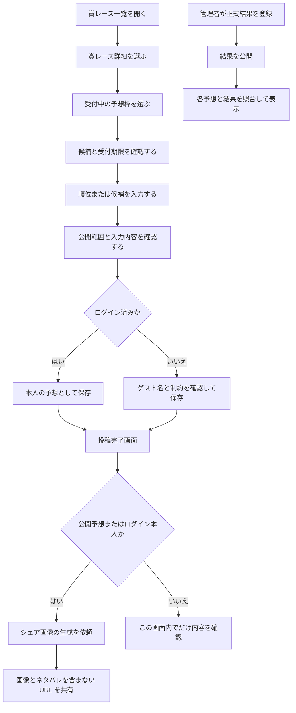
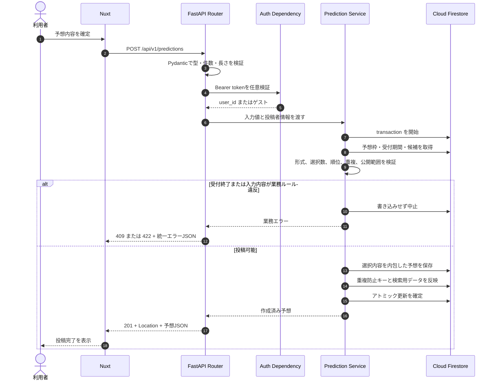
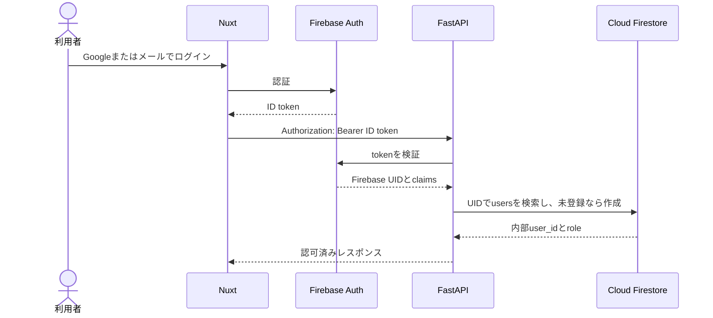
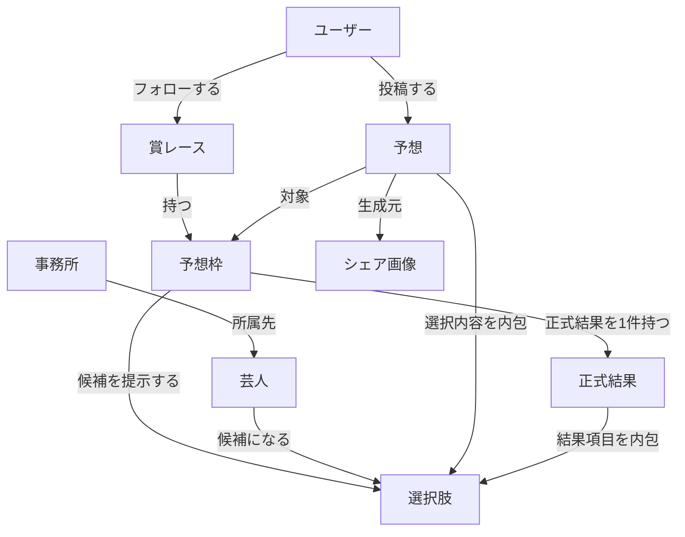

# お笑い賞レースの予想サイト

## 1. 文書の目的

お笑い賞レースの準決勝進出者、決勝進出者、優勝者などをファン同士で予想し、予想を共有して賞レースを楽しむ Web サイトの要件と設計を定義する。

本書の API・DB 設計は [FastAPI API 設計ベストプラクティス](./FastAPI_API設計ベストプラクティス.md) の API 契約、責務分離、検証、エラー設計を採用する。参照文書の RDB 固有部分はそのまま適用せず、Cloud Firestore のドキュメント、transaction、Security Rules に読み替える。

- フロントエンドは Nuxt、バックエンドは FastAPI とする。
- 認証は Firebase Authentication、業務データは Cloud Firestore に保存する。
- API は JSON over HTTPS とし、パスでバージョンを管理する。
- 日時は API では UTC の ISO 8601 形式で扱い、保存時は Firestore Timestamp へ変換する。
- 公開 ID は UUID とし、パスは複数形の kebab-case、JSON のフィールドは snake_case に統一する。

## 2. コンセプトと設計原則

### 2.1 コンセプト

- お笑い賞レースの予想を投稿・共有し、ファン同士の会話や番組への関心を高める。
- 「予想が当たった人が偉い」という価値観を作らない。
  - ユーザー単位の的中率や順位表は提供しない。
  - 全問的中者を紹介する場合も、競争を煽る恒常的なランキングにはしない。
- 投稿者は予想ごとに `public`（公開）または `private`（非公開）を選べる。
- 芸人への配慮を優先する。
  - 人気の低さを可視化するランキングは、影響を検討できるまで実装しない。
  - 宣材写真は権利者の利用条件を確認し、利用根拠と出典を記録できる画像だけを掲載する。
  - 結果公開時の告知では、SNS 上で進出者名などのネタバレを表示しない。

### 2.2 MVP の対象機能

| 利用者 | 機能 | MVP | 補足 |
| --- | --- | --- | --- |
| 全員 | 賞レース・予想枠の閲覧 | 対象 | 公開済みデータのみ |
| 全員 | 公開予想の閲覧 | 対象 | 非公開予想は含めない |
| ゲスト | 予想の投稿 | 対象 | 投稿後の編集・削除・マイページ表示は不可 |
| ログインユーザー | 予想の投稿・編集・削除 | 対象 | 受付期間内かつ本人の投稿のみ |
| ログインユーザー | 非公開予想・マイページ | 対象 | 本人だけが閲覧可能 |
| ログインユーザー | 賞レースのフォロー | 対象 | 通知機能は将来対応 |
| 全員 | シェア画像の生成 | 対象 | 公開予想、または本人の予想のみ |
| 管理者 | 賞レース・予想枠・候補・結果の管理 | 対象 | 一般 API とは権限を分離 |
| 全員 | 的中ユーザーランキング・的中率 | 対象外 | コンセプトに反するため実装しない |

### 2.3 匿名投稿の扱い

「アカウントなしでも始められる」と「所有者だけが編集できる」を曖昧なまま両立させない。MVP では次のルールとする。

- ゲスト投稿では `guest_display_name` を受け取り、`user_id` は保存しない。
- ゲスト投稿は作成後に編集・削除できない。確認画面でその旨を明示する。
- ゲストも公開・非公開を選べるが、非公開予想は作成直後のレスポンスでだけ確認でき、後から取得できない。この制約を投稿前に警告する。
- マイページ、フォロー、後日の非公開予想閲覧が必要な場合はログインを求める。
- ゲスト投稿には IP アドレスそのものを恒久保存せず、短期間のレート制限用識別子を利用する。

将来ゲスト投稿をアカウントへ引き継ぐ場合は、推測困難な引き継ぎトークンのハッシュと有効期限を専用コレクション／パスで管理する。MVP では実装しない。

## 3. 利用者の処理フロー



### 3.1 予想投稿の内部フロー



予想本体と選択内容は1つのドキュメント／ノードへまとめるか、同じトランザクションまたはアトミック更新で保存する。途中まで保存された状態を残してはならない。

### 3.2 集客・運用フロー

1. 管理者が賞レース、候補、受付期間を登録して公開する。
2. 運営の X アカウントから、芸人名などのネタバレを含まない予想ページ URL を案内する。
3. 利用者が予想し、任意で生成画像と予想詳細 URL を共有する。
4. 締切後、管理者が公式発表を確認して正式結果を下書き登録し、別の管理者確認または再確認を経て公開する。
5. 管理画面は、公開予想のうち完全一致した予想を候補として表示できる。運営者が内容を確認して紹介するが、順位、的中率、恒常的なランキングは公開しない。
6. 結果公開の X 投稿には進出者名・順位を含めず、閲覧者が自分の意思で詳細ページを開く導線にする。

## 4. 技術スタック

| 区分 | 採用技術 | 用途 |
| --- | --- | --- |
| Web | Nuxt 3 + TypeScript | SSR、一般利用者向け画面、および同一アプリの `/admin` 配下に管理画面を実装 |
| API | FastAPI + Pydantic v2 | 入出力検証、OpenAPI、HTTP API |
| DB SDK | Firebase Admin SDK | FastAPI から DB へアクセス |
| DB | Cloud Firestore | コレクション、複合クエリ、トランザクション |
| ローカル検証 | Firebase Local Emulator Suite | DB・認証・Security Rules の結合テスト |
| 認証 | Firebase Authentication | Google、メールアドレス、X 連携 |
| オブジェクトストレージ | Cloudflare R2 | 許諾済み画像、生成したシェア画像 |
| Web 配信 | Cloudflare Pages | 一般画面と `/admin` を同一アプリ・同一 Origin で配信 |
| API 実行環境 | Google Cloud Run | FastAPI コンテナ |
| 非同期処理 | Cloud Tasks 等 | シェア画像生成、将来の通知 |
| 秘密情報 | Secret Manager | DB 接続情報、Firebase 管理資格情報 |

## 5. 認証・認可

### 5.1 認証方式

- 主なログイン方法は Google とメールアドレスとする。
- X はログイン後に同一ユーザーへ連携する。連携解除してもサイトのユーザーは削除しない。
- Nuxt は Firebase Authentication から ID トークンを取得し、認証必須または任意認証 API に `Authorization: Bearer <id-token>` を付ける。
- FastAPI は Firebase Admin SDK で署名、発行者、対象者、有効期限、失効状態を検証し、トークンの `uid` から内部 `users.id` を解決する。
- `user_id`、`role`、メールアドレスをリクエスト本文から信用しない。
- アクセストークン、X のトークン、メールアドレスをログへ出さない。

初回ログイン時は、検証済み Firebase UID に対応するユーザーを冪等に作成する。メールアドレスは認証サービスを正とし、業務 DB に保存する場合も画面表示や連絡に本当に必要な最小限に留める。



### 5.2 認可ルール

| 操作 | ゲスト | user | admin |
| --- | ---: | ---: | ---: |
| 公開済み賞レース・予想枠の閲覧 | 可 | 可 | 可 |
| 公開予想の閲覧 | 可 | 可 | 可 |
| 予想の作成 | 可 | 可 | 可 |
| 自分の非公開予想の閲覧 | 不可 | 可 | 可 |
| 予想の編集・削除 | 不可 | 本人かつ受付中のみ | 可 |
| フォロー、マイページ | 不可 | 可 | 可 |
| 賞レース・候補・結果の管理 | 不可 | 不可 | 可 |

非公開予想や他人の予想に対するアクセスは、存在自体を推測されないよう原則 `404 Not Found` を返す。

## 6. データベース設計

### 6.1 採用データベース

業務データの保存先には Cloud Firestore Standard を採用する。賞レース一覧、公開予想一覧、マイページ、管理検索で複数条件の絞り込みと並べ替えが必要になるため、コレクション、複合索引、複数ドキュメントの transaction を利用する。

Firestore はドキュメント・索引エントリの read/write/delete、保存量、通信量に応じて課金される。想定 DAU、1セッション当たりの画面遷移、一覧の平均取得件数を定義し、Emulator とステージングでアクセス数を計測する。料金と無料枠は変更され得るため、実装前と公開前に [Cloud Firestore の公式料金ページ](https://firebase.google.com/docs/firestore/pricing)を確認する。

### 6.2 論理データモデル

次の図は Cloud Firestore に保存するデータの論理的な関係を示す。Firestore に RDB の外部キー制約や JOIN があることを表すものではない。



状態値の意味を混在させない。賞レースは `draft/published/archived`、予想枠は `draft/published/cancelled`、正式結果は `draft/published` とする。API の `acceptance_status` は保存値ではなく、予想枠の状態と現在時刻から `scheduled/open/closed/cancelled` を計算する。

### 6.3 Cloud Firestore コレクション設計

```text
users/{firebaseUid}
users/{firebaseUid}/socialAccounts/x
productions/{productionId}
talents/{talentId}
awardRaces/{awardRaceId}
predictionSlots/{slotId}
predictionSlots/{slotId}/options/{optionId}
predictions/{predictionId}
predictionKeys/{sha256(firebaseUid + ":" + slotId)}
predictionResults/{slotId}
follows/{sha256(firebaseUid + ":" + awardRaceId)}
shareAssets/{shareAssetId}
idempotencyKeys/{sha256(firebaseUid + ":" + operation + ":" + key)}
```

| コレクション | 主なフィールド | 設計意図 |
| --- | --- | --- |
| `users` | `public_id`, `display_name`, `role`, `created_at`, `updated_at`, `deleted_at` | ドキュメント ID は Firebase UID。UID は公開 API へ返さない |
| `users/{uid}/socialAccounts` | `provider`, `provider_subject`, `display_handle` | X の表示情報。アクセストークンは保存しない |
| `productions` | `name`, timestamps | 芸人ドキュメントから `production_id` で参照 |
| `talents` | `name`, `members`, `formed_on`, `production_id`, 画像権利情報 | メンバーは小さく上限のある配列として同じドキュメントに置く |
| `awardRaces` | `name`, `year`, `description`, `status`, `thumbnail_object_key`, timestamps | 一覧で必要な値を1ドキュメントにまとめる |
| `predictionSlots` | `award_race_id`, `title`, `format`, `min_selections`, `max_selections`, `status`, `opens_at`, `closes_at` | 予想受付ルールを管理 |
| `options` | `talent_id`, `talent_name_snapshot`, `display_order` | 親は予想枠。表示時の追加 read を避けるため名前を複製する |
| `predictions` | 投稿者、`prediction_slot_id`, `visibility`, `reason`, `selections`, `version`, timestamps | 最大20件の選択内容を配列で内包し、1 read で詳細を取得 |
| `predictionKeys` | `prediction_id`, `user_id`, `prediction_slot_id` | ログインユーザーの同一枠への二重投稿を transaction で防ぐ |
| `predictionResults` | `status`, `selections`, `published_at`, `updated_by` | ドキュメント ID を `slotId` とし、予想枠ごとに1件 |
| `follows` | `user_id`, `award_race_id`, `created_at` | 決定的 ID と transaction で二重フォローを防ぐ |
| `shareAssets` | `prediction_id`, `status`, `object_key`, `error_code`, timestamps | `queued/processing/completed/failed` を管理 |
| `idempotencyKeys` | `user_id`, `operation`, `key_hash`, `request_hash`, `response`, `expires_at` | 認証済み POST の再送結果を24時間再利用 |

予想ドキュメント例:

```json
{
  "id": "018f47b2-f23d-7bc1-a231-90fca62d7e65",
  "prediction_slot_id": "018f47b2-14bb-7a62-a9c9-2f23d25ab421",
  "user_id": "firebase-uid-internal-only",
  "guest_display_name": null,
  "author_display_name_snapshot": "予想好き",
  "visibility": "public",
  "reason": "今年のネタの安定感を重視しました。",
  "selections": [
    {
      "question_option_id": "018f47b2-5f3f-71de-bf54-b24345e18402",
      "talent_name_snapshot": "サンプルコンビA",
      "rank": 1
    }
  ],
  "version": 1,
  "created_at": "Firestore Timestamp",
  "updated_at": "Firestore Timestamp",
  "deleted_at": null
}
```

`user_id` などの内部値は保存例であり、API レスポンスへそのまま返さない。名前のスナップショットは意図的な非正規化である。芸人名・ユーザー名の変更を過去投稿へ反映するかを決め、反映する場合はバックフィル処理を用意する。

### 6.4 整合性とアトミック更新

Cloud Firestore には RDB の外部キー・CHECK・複合一意制約がないため、Pydantic、Service、決定的なキー、transaction / batch で守る。FastAPI を唯一の書き込み経路とし、クライアント SDK からの業務データへの直接書き込みは Security Rules で拒否する。

| ルール | Pydantic | Service | 保存時の競合対策 |
| --- | ---: | ---: | --- |
| `visibility` が許可値 | ○ | ○ | 不正値を書き込まない |
| 選択数が1〜20 | ○ | ○ | 予想1件に配列で保存 |
| 予想枠の min/max を満たす |  | ○ | transaction 内で予想枠を再読込 |
| 選択肢が対象の予想枠に属する |  | ○ | 候補を読み、所属と重複を検証 |
| `ranking` の順位が連続し重複しない |  | ○ | 配列全体を検証して一括保存 |
| `selection` では順位を指定しない |  | ○ | 配列全体を検証して一括保存 |
| 受付期間外は投稿・編集不可 |  | ○ | transaction 内で状態と時刻を再確認 |
| 同じユーザー・同じ枠は1件 |  | ○ | `predictionKeys` の決定的 ID を transaction で作成 |
| 投稿者は user または guest の一方 | ○ | ○ | 保存前に排他的条件を検証 |

Firestore では、予想枠、選択肢、`predictionKeys` をすべて読んだ後に予想とキーを書き込む transaction を使う。Firestore transaction は競合時に再実行され得るため、外部 API 呼び出しやメール送信を transaction 関数内で行わない。

受付中に本人が予想を削除した場合は、予想の `deleted_at` 設定と `predictionKeys` の削除を同じ transaction で行い、別の `Idempotency-Key` による再投稿を許可する。

ゲストには安定した所有者 ID がないため、同一人物の二重投稿を完全には防げない。短期間のレート制限と不正検知を併用し、この限界を仕様として扱う。

`Idempotency-Key` は認証済みの予想作成で受け付ける。同じユーザー・操作・キー・本文の再送には最初の結果を返し、同じキーで本文だけが異なる場合は `409 IDEMPOTENCY_KEY_REUSED` とする。安定した所有者 ID がないゲスト投稿には適用しない。

### 6.5 クエリ、索引、コスト対策

Firestore では次のクエリを実装前に Emulator で実行し、要求された複合索引を `firestore.indexes.json` で管理する。

- `awardRaces`: `status == published`、`year desc`
- `predictionSlots`: `award_race_id == ...`、`opens_at asc`
- `predictions`: `prediction_slot_id == ...`、`visibility == public`、`deleted_at == null`、`created_at desc`
- `predictions`: `user_id == current_user`、`deleted_at == null`、`updated_at desc`

Firestore はクエリ結果が0件でも最低読み取り料金が発生し、リアルタイムリスナーは結果の追加・更新でも read が増える。公開予想一覧は常時 listen せず、通常のページング GET と短時間キャッシュを基本にする。ドキュメントは常に全体取得されるため、一覧で巨大化するフィールドや画像本体を含めない。

コスト対策:

- 公開済み賞レースと予想枠には `Cache-Control` と ETag を設定し、Cloudflare で短時間キャッシュする。
- 管理画面の一覧も全件取得せずページングする。
- シェア画像の状態確認は指数バックオフし、完了後はポーリングを止める。
- 月次で Firestore の read/write/delete 数、保存量、通信量を記録する。
- 予算アラートだけで自動停止を保証できるとは考えず、API の利用上限と異常検知を併用する。

### 6.6 元設計からの主な修正理由

- `everyones_expectation` は意味が曖昧なため、業務用語の `predictions` に変更した。
- 予想に `award_race_id` を重複保存せず、`prediction_slot_id` から解決する。ただし計測で read 削減効果が確認できた場合は、同期規則を明記したうえでスナップショットを追加できる。
- 選択内容は最大20件で予想と常に同時取得するため、予想ドキュメント内の配列として保存する。
- `question_options` の形式は親の予想枠で管理し、候補ごとに重複保存しない。
- 正式結果を候補へ混在させず、`predictionResults` として分離する。
- 芸人メンバーは小さく上限のある配列として `talents` に内包し、カンマ区切り文字列にはしない。
- 非正規化する値には `_snapshot` を付け、正となるデータ、同期方法、修復方法を明示する。

## 7. 画面ルートとディレクトリマップ

### 7.1 一般 Web の画面ルート

URL は複数形の kebab-case に統一する。投稿確認と完了は予想入力フローの状態であり、サーバー上の独立リソースではないため、基本的には同じ `predict` 画面内のステップとして扱う。

| URL | 画面 | 認証 |
| --- | --- | --- |
| `/` | 開催中・近日開催の賞レース | 不要 |
| `/auth/login` | ログイン | 不要 |
| `/auth/password-reset` | パスワード再設定 | 不要 |
| `/award-races` | 賞レース一覧 | 不要 |
| `/award-races/[awardRaceId]` | 賞レース詳細・予想枠一覧 | 不要 |
| `/prediction-slots/[slotId]` | 予想枠詳細・候補・公開予想一覧 | 不要 |
| `/prediction-slots/[slotId]/predict` | 予想入力・確認・完了 | 任意。ゲスト可 |
| `/predictions/[predictionId]` | 公開予想または本人の予想詳細 | 条件付き |
| `/me` | マイページ | 必須 |
| `/me/predictions` | 自分の予想一覧 | 必須 |
| `/me/followed-award-races` | フォロー中の賞レース | 必須 |
| `/settings/profile` | 表示名・連携アカウント設定 | 必須 |
| `/terms` | 利用規約 | 不要 |
| `/privacy` | プライバシーポリシー | 不要 |
| `/contact` | 問い合わせ案内 | 不要 |

### 7.2 管理画面ルート

管理画面は一般画面と同じ Nuxt アプリ内の `/admin` 配下に実装し、同じ Origin・同じデプロイ単位とする。

| URL | 画面 |
| --- | --- |
| `/admin` | ダッシュボード |
| `/admin/award-races` | 賞レース管理 |
| `/admin/award-races/[awardRaceId]` | 賞レース編集・予想枠管理 |
| `/admin/prediction-slots/[slotId]` | 候補・受付期間管理 |
| `/admin/prediction-slots/[slotId]/result` | 正式結果の下書き・公開 |

Nuxt のルートミドルウェアで未ログインユーザーや一般ユーザーの画面遷移を制御する。ただし、クライアント側の制御だけに依存せず、管理 API の呼び出しごとに FastAPI で `users.role=admin` を確認する。

### 7.3 実装ディレクトリ案

```text
award_race_app/
├── apps/
│   ├── web/                         # 一般画面と管理画面を含む Nuxt
│   │   ├── pages/
│   │   │   └── admin/              # /admin 配下の管理画面
│   │   ├── components/
│   │   │   └── admin/              # 管理画面専用コンポーネント
│   │   ├── composables/
│   │   ├── middleware/
│   │   │   └── admin.ts            # 管理画面への遷移制御
│   │   ├── stores/
│   │   └── types/
│   └── api/
│       ├── app/
│       │   ├── main.py
│       │   ├── api/
│       │   │   ├── dependencies.py
│       │   │   ├── exception_handlers.py
│       │   │   └── v1/
│       │   │       ├── router.py
│       │   │       └── endpoints/
│       │   │           ├── award_races.py
│       │   │           ├── prediction_slots.py
│       │   │           ├── predictions.py
│       │   │           ├── me.py
│       │   │           ├── share_assets.py
│       │   │           └── admin/
│       │   │               ├── award_races.py
│       │   │               ├── prediction_slots.py
│       │   │               └── results.py
│       │   ├── schemas/             # Pydantic 入出力モデル
│       │   ├── services/            # 業務ルール、トランザクション境界
│       │   ├── repositories/
│       │   │   ├── interfaces.py    # Repository の契約
│       │   │   └── firestore/       # Firestore の読み書きと transaction
│       │   ├── domain/              # 業務モデルと値オブジェクト
│       │   ├── core/                # 設定、認証、ログ
│       │   └── workers/             # シェア画像生成など
│       ├── firebase/
│       │   ├── firestore.indexes.json
│       │   └── firestore.rules
│       ├── scripts/
│       │   └── data_migrations/     # スキーマ版変更・バックフィル
│       └── tests/
│           ├── unit/
│           ├── integration/         # Firebase Emulator を使用
│           └── contract/
├── packages/
│   └── api-client/                  # OpenAPI から生成する TS client
├── infra/                           # Cloud Run、DB、R2 等の IaC
├── doc/
└── .github/workflows/
```

Router に Firebase SDK 呼び出しや業務ルールを書かず、`Router → Service → Repository → Cloud Firestore` の依存方向を守る。Service がアトミックに扱う範囲を決め、Repository が Firestore の transaction / batch へ変換する。

## 8. API 設計

### 8.1 共通仕様

- Base URL: `/api/v1`
- Content-Type: `application/json`
- 認証: `Authorization: Bearer <Firebase ID token>`
- 日時: `2026-09-28T10:30:00Z` のような UTC ISO 8601
- 一覧: `limit` は既定20、最大100。Firestore で読み飛ばし課金が発生する `offset` は使わず、`cursor` によるページングとする。カーソルは並べ替え値とドキュメント ID を含む不透明な文字列とし、クライアントは内容を解釈しない。
- リクエスト追跡: `X-Request-ID` を受け付け、レスポンスにも返す。
- 作成成功: `201 Created` と `Location` を返す。
- 削除成功: `204 No Content` とし、本文を返さない。
- 未認証: `401`、権限不足: `403`、未存在または存在秘匿: `404`、状態競合: `409`、入力検証: `422`。
- 入力モデルと出力モデルを分け、DB モデルをそのまま返さない。

### 8.2 エンドポイント一覧

#### 公開・利用者 API

| Method | Path | 認証 | 用途 | 成功 |
| --- | --- | --- | --- | --- |
| `GET` | `/award-races` | 不要 | 公開賞レース一覧 | `200` |
| `GET` | `/award-races/{award_race_id}` | 不要 | 賞レース詳細 | `200` |
| `GET` | `/award-races/{award_race_id}/prediction-slots` | 不要 | 賞レース配下の予想枠一覧 | `200` |
| `GET` | `/prediction-slots/{slot_id}` | 不要 | 候補を含む予想枠詳細 | `200` |
| `GET` | `/prediction-slots/{slot_id}/predictions` | 不要 | 公開予想一覧 | `200` |
| `POST` | `/predictions` | 任意 | ログインまたはゲストで予想作成 | `201` |
| `GET` | `/predictions/{prediction_id}` | 任意 | 公開予想または本人の予想詳細 | `200` |
| `PUT` | `/predictions/{prediction_id}` | 必須 | 本人の予想全体を受付中に置換 | `200` |
| `DELETE` | `/predictions/{prediction_id}` | 必須 | 本人の予想を受付中に削除 | `204` |
| `GET` | `/me` | 必須 | 自分のプロフィール | `200` |
| `PATCH` | `/me` | 必須 | 表示名などを部分更新 | `200` |
| `GET` | `/me/predictions` | 必須 | 自分の公開・非公開予想一覧 | `200` |
| `PUT` | `/me/social-accounts/x` | 必須 | Firebase 上の X 連携情報を同期 | `200` |
| `DELETE` | `/me/social-accounts/x` | 必須 | X 表示情報の連携解除 | `204` |
| `PUT` | `/me/followed-award-races/{award_race_id}` | 必須 | フォロー状態にする | `204` |
| `DELETE` | `/me/followed-award-races/{award_race_id}` | 必須 | フォロー解除 | `204` |
| `POST` | `/predictions/{prediction_id}/share-assets` | 任意 | シェア画像生成ジョブを作成 | `202` |
| `GET` | `/share-assets/{share_asset_id}` | 任意 | 画像生成状態を取得 | `200` |

#### 管理 API

| Method | Path | 用途 | 成功 |
| --- | --- | --- | --- |
| `POST` | `/admin/award-races` | 賞レース作成 | `201` |
| `PATCH` | `/admin/award-races/{award_race_id}` | 賞レース部分更新 | `200` |
| `POST` | `/admin/award-races/{award_race_id}/prediction-slots` | 予想枠作成 | `201` |
| `PATCH` | `/admin/prediction-slots/{slot_id}` | 受付期間・状態の更新 | `200` |
| `POST` | `/admin/prediction-slots/{slot_id}/question-options` | 候補追加 | `201` |
| `DELETE` | `/admin/question-options/{option_id}` | 未公開候補の削除 | `204` |
| `PUT` | `/admin/prediction-slots/{slot_id}/result` | 正式結果の作成・全体置換 | `200` または `201` |
| `GET` | `/admin/prediction-slots/{slot_id}/perfect-predictions` | 公開予想から完全一致候補を確認 | `200` |

公開済み予想枠の候補を削除すると既存予想を壊すため禁止し、`409 OPTION_IN_USE` を返す。訂正が必要な場合はデータ移行スクリプトまたは専用の管理ユースケースとして別途設計する。
完全一致候補 API は結果公開後だけ利用できる管理者専用 API とし、ユーザーの順位や通算的中率を計算・返却しない。

`PUT /me/social-accounts/x` は本文で X のユーザー ID を受け取らず、Firebase Admin SDK で現在の `uid` に連携済みの provider 情報を取得して `users/{uid}/socialAccounts/x` へ反映する。X の OAuth アクセストークンは業務 DB に保存しない。Firebase 側でも連携を解除した後に `DELETE` を呼び、ローカル表示情報を削除する。

### 8.3 賞レース一覧

```http
GET /api/v1/award-races?year=2026&status=published&sort=-year&limit=20
Accept: application/json
```

```json
{
  "items": [
    {
      "id": "018f47b2-9347-738b-99c6-3c95f6999a82",
      "name": "サンプルお笑いグランプリ",
      "year": 2026,
      "description": "今年一番おもしろい漫才師を決める大会です。",
      "status": "published",
      "thumbnail_url": "https://assets.example.com/award-races/sample.webp"
    }
  ],
  "page": {
    "limit": 20,
    "next_cursor": null,
    "has_next": false
  }
}
```

0件の場合も `200 OK` と `items: []` を返す。次ページがある場合は `next_cursor` を次のリクエストの `cursor` にそのまま指定する。`sort` は許可リストから Firestore の索引済みフィールドへ明示的にマッピングする。

### 8.4 予想枠詳細

```http
GET /api/v1/prediction-slots/018f47b2-14bb-7a62-a9c9-2f23d25ab421
```

```json
{
  "id": "018f47b2-14bb-7a62-a9c9-2f23d25ab421",
  "award_race": {
    "id": "018f47b2-9347-738b-99c6-3c95f6999a82",
    "name": "サンプルお笑いグランプリ",
    "year": 2026
  },
  "title": "決勝進出者予想",
  "description": "決勝へ進出する2組を選んでください。",
  "format": "selection",
  "min_selections": 2,
  "max_selections": 2,
  "acceptance_status": "open",
  "opens_at": "2026-09-01T00:00:00Z",
  "closes_at": "2026-10-01T09:00:00Z",
  "options": [
    {
      "id": "018f47b2-5f3f-71de-bf54-b24345e18402",
      "talent": {
        "id": "018f47b2-e55a-7054-8a18-ea5e7b991610",
        "name": "サンプルコンビA",
        "image_url": null
      },
      "display_order": 1
    },
    {
      "id": "018f47b2-6b6b-773f-a51b-72ed4d658f92",
      "talent": {
        "id": "018f47b2-c611-7ab5-bb7b-30fb0f478451",
        "name": "サンプルコンビB",
        "image_url": null
      },
      "display_order": 2
    }
  ],
  "result": null
}
```

`result` は管理者が `published` にするまで公開レスポンスへ含めない。

### 8.5 予想作成

#### ログインユーザーの ranking 形式

```http
POST /api/v1/predictions HTTP/1.1
Authorization: Bearer <firebase-id-token>
Content-Type: application/json
Idempotency-Key: 3b1d4f65-22e4-4e11-9284-690e8cc37d32
```

```json
{
  "prediction_slot_id": "018f47b2-14bb-7a62-a9c9-2f23d25ab421",
  "visibility": "public",
  "reason": "今年のネタの安定感を重視しました。",
  "selections": [
    {
      "question_option_id": "018f47b2-5f3f-71de-bf54-b24345e18402",
      "rank": 1
    },
    {
      "question_option_id": "018f47b2-6b6b-773f-a51b-72ed4d658f92",
      "rank": 2
    }
  ]
}
```

#### ゲストの selection 形式

```json
{
  "prediction_slot_id": "018f47b2-27ac-75fc-8653-2aac046518b2",
  "guest_display_name": "お笑い好きゲスト",
  "visibility": "public",
  "reason": null,
  "selections": [
    {
      "question_option_id": "018f47b2-5f3f-71de-bf54-b24345e18402"
    },
    {
      "question_option_id": "018f47b2-6b6b-773f-a51b-72ed4d658f92"
    }
  ]
}
```

ログイン済みリクエストで `guest_display_name` が送られた場合は `422` とする。`user_id`、`created_at`、的中情報はクライアントから受け付けない。

#### 成功レスポンス

```http
HTTP/1.1 201 Created
Location: /api/v1/predictions/018f47b2-f23d-7bc1-a231-90fca62d7e65
ETag: "prediction-018f47b2-f23d-7bc1-a231-90fca62d7e65-v1"
```

```json
{
  "id": "018f47b2-f23d-7bc1-a231-90fca62d7e65",
  "prediction_slot_id": "018f47b2-14bb-7a62-a9c9-2f23d25ab421",
  "author": {
    "type": "user",
    "display_name": "予想好き"
  },
  "visibility": "public",
  "reason": "今年のネタの安定感を重視しました。",
  "selections": [
    {
      "question_option_id": "018f47b2-5f3f-71de-bf54-b24345e18402",
      "talent_name": "サンプルコンビA",
      "rank": 1
    },
    {
      "question_option_id": "018f47b2-6b6b-773f-a51b-72ed4d658f92",
      "talent_name": "サンプルコンビB",
      "rank": 2
    }
  ],
  "result_comparison": null,
  "version": 1,
  "created_at": "2026-09-28T10:30:00Z",
  "updated_at": "2026-09-28T10:30:00Z",
  "links": {
    "self": "/api/v1/predictions/018f47b2-f23d-7bc1-a231-90fca62d7e65",
    "share_assets": "/api/v1/predictions/018f47b2-f23d-7bc1-a231-90fca62d7e65/share-assets"
  }
}
```

`result_comparison` は結果公開後にだけ、各選択が正式結果に含まれたかを表示する。的中率や利用者順位は返さない。

### 8.6 予想更新と同時更新制御

予想全体の置換には `PUT` を使い、作成時と同じ `visibility`、`reason`、`selections` を送る。`prediction_slot_id` と投稿者は変更できない。取得時の `ETag` を `If-Match` で送り、別端末による更新を上書きしない。

```http
PUT /api/v1/predictions/018f47b2-f23d-7bc1-a231-90fca62d7e65
Authorization: Bearer <firebase-id-token>
If-Match: "prediction-018f47b2-f23d-7bc1-a231-90fca62d7e65-v1"
Content-Type: application/json
```

```json
{
  "visibility": "private",
  "reason": "直近の敗者復活戦を見て変更しました。",
  "selections": [
    {
      "question_option_id": "018f47b2-6b6b-773f-a51b-72ed4d658f92",
      "rank": 1
    },
    {
      "question_option_id": "018f47b2-5f3f-71de-bf54-b24345e18402",
      "rank": 2
    }
  ]
}
```

- ETag 不一致は `412 Precondition Failed`。
- 締切後の更新・削除は `409 PREDICTION_CLOSED`。
- 他人の投稿または非公開投稿は `404`。
- 成功時は `version` を増やし、新しい ETag と `200` を返す。

### 8.7 公開予想一覧

```http
GET /api/v1/prediction-slots/018f47b2-14bb-7a62-a9c9-2f23d25ab421/predictions?limit=20
```

```json
{
  "items": [
    {
      "id": "018f47b2-f23d-7bc1-a231-90fca62d7e65",
      "author": {
        "type": "user",
        "display_name": "予想好き"
      },
      "reason": "今年のネタの安定感を重視しました。",
      "selections": [
        {
          "talent_name": "サンプルコンビA",
          "rank": 1
        }
      ],
      "created_at": "2026-09-28T10:30:00Z"
    }
  ],
  "page": {
    "limit": 20,
    "next_cursor": null,
    "has_next": false
  }
}
```

非公開予想、削除済み予想、メールアドレス、Firebase UID は含めない。ユーザー名を後から変更した場合は最新の表示名を返し、投稿時点の名前を残す必要が生じた場合だけスナップショット列を追加する。

### 8.8 正式結果の登録・公開

管理者は下書き保存後、内容を確認して公開する。`status=published` と `published_at` の確定、結果明細の保存を1トランザクションで行う。
結果を初めて作成した場合は `201 Created` と `Location`、既存の結果を置換した場合は `200 OK` を返す。

```http
PUT /api/v1/admin/prediction-slots/018f47b2-14bb-7a62-a9c9-2f23d25ab421/result
Authorization: Bearer <admin-firebase-id-token>
Content-Type: application/json
```

```json
{
  "status": "published",
  "selections": [
    {
      "question_option_id": "018f47b2-5f3f-71de-bf54-b24345e18402",
      "rank": 1
    },
    {
      "question_option_id": "018f47b2-6b6b-773f-a51b-72ed4d658f92",
      "rank": 2
    }
  ]
}
```

```json
{
  "id": "018f47b2-4ba2-7654-899c-00a54accf333",
  "prediction_slot_id": "018f47b2-14bb-7a62-a9c9-2f23d25ab421",
  "status": "published",
  "published_at": "2026-10-02T12:00:00Z",
  "selections": [
    {
      "question_option_id": "018f47b2-5f3f-71de-bf54-b24345e18402",
      "talent_name": "サンプルコンビA",
      "rank": 1
    },
    {
      "question_option_id": "018f47b2-6b6b-773f-a51b-72ed4d658f92",
      "talent_name": "サンプルコンビB",
      "rank": 2
    }
  ]
}
```

公開時の SNS 告知文には芸人名を自動挿入せず、「結果が公開されました」のようなネタバレを含まない定型文を使う。

### 8.9 シェア画像生成

画像生成はリクエスト内で完了させず、ジョブを作成して `202 Accepted` を返す。

```http
POST /api/v1/predictions/018f47b2-f23d-7bc1-a231-90fca62d7e65/share-assets
Authorization: Bearer <firebase-id-token>
Content-Type: application/json
```

```json
{
  "template": "square",
  "hide_result": true
}
```

```http
HTTP/1.1 202 Accepted
Location: /api/v1/share-assets/018f47b2-d1ee-7676-a145-33600d0f7881
Retry-After: 3
```

```json
{
  "id": "018f47b2-d1ee-7676-a145-33600d0f7881",
  "status": "queued",
  "image_url": null,
  "status_url": "/api/v1/share-assets/018f47b2-d1ee-7676-a145-33600d0f7881"
}
```

完了後の取得例:

```json
{
  "id": "018f47b2-d1ee-7676-a145-33600d0f7881",
  "status": "completed",
  "image_url": "https://assets.example.com/share/018f47b2-d1ee-7676-a145-33600d0f7881.webp",
  "expires_at": "2026-10-05T10:30:00Z"
}
```

非公開予想の画像生成と状態取得は本人だけに許可する。画像 URL の公開範囲も予想の公開範囲と一致させる。
ゲストの非公開予想は後から本人確認できないため、シェア画像を生成できない。

### 8.10 統一エラーレスポンス

```http
HTTP/1.1 422 Unprocessable Entity
Content-Type: application/json
X-Request-ID: 018f47b2-9b0d-7c2f-9038-3db6889e0871
```

```json
{
  "error": {
    "code": "DUPLICATE_RANK",
    "message": "同じ順位を複数の候補に設定できません。",
    "details": [
      {
        "field": "selections.1.rank",
        "reason": "rank 1 が重複しています"
      }
    ],
    "trace_id": "018f47b2-9b0d-7c2f-9038-3db6889e0871"
  }
}
```

| code | HTTP | 条件 |
| --- | ---: | --- |
| `AUTHENTICATION_REQUIRED` | `401` | 必須トークンなし、無効、期限切れ |
| `RESOURCE_NOT_FOUND` | `404` | 対象なし、または存在を秘匿 |
| `PREDICTION_CLOSED` | `409` | 受付期間外の作成・更新・削除 |
| `PREDICTION_ALREADY_EXISTS` | `409` | 同じユーザーが同じ枠へ二重投稿 |
| `IDEMPOTENCY_KEY_REUSED` | `409` | 同じ冪等キーが異なる内容で再利用された |
| `OPTION_IN_USE` | `409` | 既存予想から参照される候補を削除しようとした |
| `INVALID_SELECTION_COUNT` | `422` | 選択数が予想枠の制約外 |
| `OPTION_NOT_IN_SLOT` | `422` | 候補が対象予想枠に属さない |
| `DUPLICATE_RANK` | `422` | 同一予想内で順位が重複 |
| `RATE_LIMIT_EXCEEDED` | `429` | 投稿・画像生成回数の上限超過 |
| `INTERNAL_ERROR` | `500` | 想定外エラー。内部情報は返さない |

内部のコレクション／パス名、Firebase SDK の例外詳細、スタックトレースはレスポンスへ含めず、`trace_id` とともに構造化ログへ記録する。

## 9. セキュリティ・運用

- CORS は同一 Nuxt アプリを配信する既知の Web Origin に対し、必要なメソッド・ヘッダーだけを許可する。
- 公開 API、ゲスト投稿、ログイン、画像生成には用途別のレート制限を設ける。
- R2 へのアップロードでは MIME タイプだけでなく、実データ、サイズ、拡張子を検証する。
- 画像の `object_key` を DB に保存し、署名 URL または CDN URL はレスポンス生成時に組み立てる。
- Nuxt から Cloud Firestore へ直接読み書きさせず、業務データは FastAPI 経由に統一する。Cloud Run のサービスアカウントには Firestore への必要最小限の IAM 権限だけを与える。Admin SDK は Security Rules を迂回するため、API の認可テストを必須とする。
- 論理削除したユーザーの表示名は匿名化し、法令・規約に基づく保持期間後に個人情報を削除する。
- バックアップに加えて復元テストを行い、RPO と RTO を定義する。
- 問い合わせは専用フォームまたはメールで受け付け、X の DM はサポート窓口にしない。

## 10. テストと受け入れ基準

### 10.1 API・業務ルール

- 正常な予想作成で `201`、`Location`、仕様どおりの JSON が返る。
- 保存処理へ障害を注入しても、Firestore transaction により選択内容や `predictionKeys` の欠けた予想が残らない。
- 締切前は本人が更新・削除でき、締切後は `409` になる。
- ゲスト投稿は作成できるが、更新・削除・マイページ取得はできない。
- 非公開予想は本人以外の一覧・詳細・シェア画像 API に現れない。
- 同一ユーザー・同一予想枠の二重投稿は、同時リクエストでも `predictionKeys` の決定的 ID と Firestore transaction により `409` になる。
- 別の予想枠の候補、候補の重複、順位の欠番・重複、選択数違反は `422` になる。
- 正式結果は下書き中に公開 API へ現れず、公開後にだけ表示される。
- 的中率やユーザーランキングを返す API が存在しない。

### 10.2 HTTP・セキュリティ

- `401`、`403`、`404`、`409`、`412`、`422`、`429` を仕様どおり使い分ける。
- すべてのエラーが `code`, `message`, `details`, `trace_id` を持つ。
- 一覧の `limit` は100を超えられず、0件は `200` と空配列になる。
- Firebase UID、メールアドレス、アクセストークン、DB 内部列が公開レスポンスへ混入しない。
- OpenAPI のリクエスト・成功・エラースキーマをコントラクトテストで検証する。
- 代表的な一覧 API で不要な追加 read が発生せず、1リクエスト当たりのドキュメント read 数またはダウンロード byte 数が想定上限内である。

## 11. 未決事項

- 芸人ごとの人気集計を提供するか。コンセプトと出演者への影響を検討するまで実装しない。
- 過去の賞レース結果・受賞履歴をどの出典と利用条件で掲載するか。
- 各事務所・大会の宣材写真を利用できるか。許諾確認前は画像を表示しない。
- ゲスト投稿のアカウント引き継ぎを将来提供するか。
